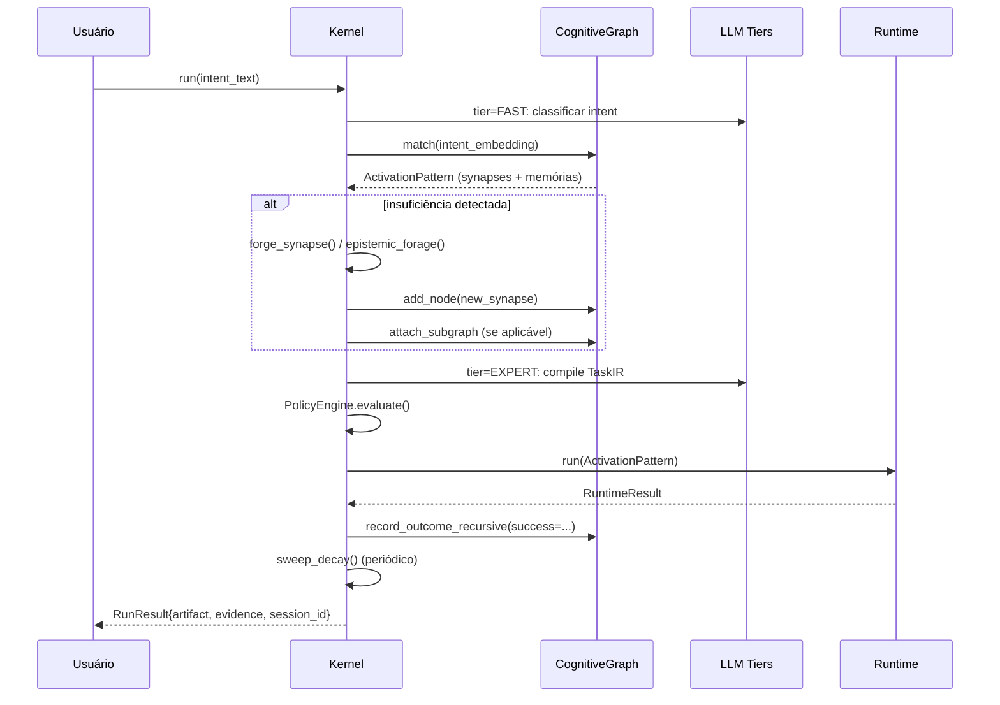

# ◉ Arnaldo — Arquitetura

> Documento canônico. Define formalmente o sistema. Acompanha o `README.md`
> (entrada) e `docs/operations.md` (guia operacional).

---

## Sumário

1. [Tese e posicionamento](#1-tese-e-posicionamento)
2. [Princípios e invariantes](#2-princípios-e-invariantes)
3. [Arquitetura geral](#3-arquitetura-geral)
4. [Modelo formal do grafo cognitivo](#4-modelo-formal-do-grafo-cognitivo)
5. [Nós tipados](#5-nós-tipados)
6. [Arestas tipadas](#6-arestas-tipadas)
7. [Modelo bi-temporal](#7-modelo-bi-temporal)
8. [Proveniência epistêmica](#8-proveniência-epistêmica)
9. [Plasticidade sináptica](#9-plasticidade-sináptica)
10. [Decaimento adaptativo](#10-decaimento-adaptativo)
11. [Retrieval híbrido](#11-retrieval-híbrido)
12. [Grafos referenciando grafos](#12-grafos-referenciando-grafos)
13. [Agentes especializados e composição](#13-agentes-especializados-e-composição)
14. [Pipeline do kernel](#14-pipeline-do-kernel)
15. [Camada LLM (4 tiers)](#15-camada-llm-4-tiers)
16. [Saídas estruturadas (`response_format`)](#16-saídas-estruturadas-response_format)
17. [Sistema epistêmico (foragem)](#17-sistema-epistêmico-foragem)
18. [Frontend e observabilidade](#18-frontend-e-observabilidade)
19. [Envelope de capacidades (corte máximo)](#19-envelope-de-capacidades-corte-máximo)
20. [Estado de implementação](#20-estado-de-implementação)
21. [Critérios de aceitação](#21-critérios-de-aceitação)
22. [Riscos honestos](#22-riscos-honestos)
23. [Referências canônicas](#23-referências-canônicas)

---

## 1. Tese e posicionamento

### 1.1 Tese em uma frase

> **Arnaldo é um substrate cognitivo simbólico: um grafo único, vivo e
> auditável, onde memórias, agentes e ferramentas co-existem como nós
> persistentes ligados por arestas tipadas com plasticidade Hebbian. Cada
> nó pode possuir ou referenciar outros grafos, formando uma hierarquia
> composicional.**

Não é mais um framework de agentes. Não é wrapper de LLM. É **infraestrutura
para autonomia que acumula valor com o tempo** — onde conhecimento adquirido
em uma run é ativo capturado pelo sistema para ser reutilizado, refinado e
auditado.

### 1.2 Posicionamento de mercado

A indústria de agentes em 2025-2026 está dividida em dois eixos: **rigor
estrutural** e **transparência do modelo**.

```
                                         estrutura
                                         elevada
                                            │
                                            │
                         LangGraph ──── ARNALDO (alvo)
                       (state machine)  (substrate cognitivo)
                                            │
   ◄────────────────────────────────────────┼────────────────────────────────►
   modelo                                   │                          modelo
   opaco                                    │                       transparente
                                            │
                          OpenClaw ──── CrewAI / AutoGen
                       (runtime monolítico) (role-based)
                                            │
                                            │
                                         estrutura
                                         frouxa
```

| Framework        | Memória persistente | Plasticidade | Auditabilidade | Hierarquia |
|------------------|---------------------|--------------|----------------|------------|
| LangGraph        | Bolt-on (Checkpoint) | Não         | Trace          | Subgraphs estáticos |
| CrewAI           | Por-task            | Não          | Logs           | Não        |
| AutoGen          | Por-conversa        | Não          | Logs           | Não        |
| OpenClaw         | Arquivo MD          | Manual       | Limitada       | Não        |
| **Arnaldo**      | **Grafo vivo**      | **Hebbian**  | **Ledger causal** | **GraphRef** |

LangGraph trata memória como *bolt-on*. Arnaldo move o ponto de equilíbrio:
faz da memória o **substrato**, e dos agentes peças residentes nesse
substrato.

---

## 2. Princípios e invariantes

### 2.1 Princípios de design

1. **Estrutura simbólica é o piso garantido.** LLM eleva qualidade, mas a
   estrutura nunca depende dele. Falha de LLM ⇒ heurística determinística.
2. **Tipagem antes de fluxo.** Tipos discretos de nó e aresta tornam o
   sistema auditável e debuggável.
3. **Proveniência obrigatória.** Sem origem, sem inserção. Toda decisão
   tem cadeia causal recuperável.
4. **Plasticidade é matemática, não mágica.** Atualizações são funções
   puras com bounds explícitos.
5. **Decaimento é adaptativo por domínio.** Decay uniforme é pior que
   nenhum decay (Kim et al., 2024).
6. **Hierarquia é composição.** Grafos podem ser donos ou referenciar
   outros grafos — Society of Mind levado ao limite.

### 2.2 Os sete invariantes

```
I1. Tipagem.       Todo nó tem kind ∈ NodeKind;
                   toda aresta tem kind ∈ EdgeKind.

I2. Proveniência.  Todo nó e toda aresta carregam SourceRecord não-vazio.

I3. Bi-temporal.   Toda relação carrega (T, T′) — quando vigorou no mundo
                   e quando o sistema soube disso.

I4. Plasticidade.  Pesos ∈ [floor, ceiling] ⊂ [0,1].
                   Atualizações limitadas a |Δw| ≤ cap_per_step.

I5. Decay tipado.  Half-life por domain, nunca uniforme.

I6. Auditabilidade. Toda mutação no grafo gera GraphEvent persistível.

I7. DAG hierarquia. GraphRef forma um DAG —
                   ciclos são rejeitados (GraphCycleError).
```

Violar qualquer invariante ⇒ exceção na operação (não falha silenciosa).

### 2.3 Filiação teórica

Quatro tradições convergem na fundação:

| Tradição                          | Contribuição                                  |
|-----------------------------------|-----------------------------------------------|
| Society of Mind (Minsky, 1986)    | Agentes simples compõem cognição complexa     |
| Cognitive Architectures (CoALA)   | Tripartição declarativa / procedural / working|
| Plasticidade Hebbian (Hebb, 1949) | Co-ativação bem-sucedida aumenta peso         |
| MAGMA (Jiang et al., 2026)        | Multi-grafo direcionado com retrieval policy  |
| Hierarchical GNs (Battaglia, 2018)| Composição de grafos em níveis                |

---

## 3. Arquitetura geral

### 3.1 Diagrama de camadas

```
┌────────────────────────────────────────────────────────────────────┐
│                       CAMADA 0: ENTRADA                             │
│   CLI · API Python · (futuro: MCP/A2A servers)                      │
├────────────────────────────────────────────────────────────────────┤
│                  CAMADA 1: COMPILAÇÃO DECLARATIVA                   │
│   IntentCompiler → TaskCompiler → CognitiveControlPlane            │
│   (cada um usa LLM tier apropriado, com fallback heurístico)       │
├────────────────────────────────────────────────────────────────────┤
│                CAMADA 2: SUBSTRATE COGNITIVO                        │
│   ┌──────────────────────────────────────────────────────────┐    │
│   │              CognitiveGraph (substrate vivo)             │    │
│   │  ┌────────────┐  ┌────────────┐  ┌────────────┐         │    │
│   │  │MemoryNode  │  │SynapseNode │  │CapabilityNode        │    │
│   │  └────────────┘  └────────────┘  └────────────┘         │    │
│   │   arestas tipadas + plasticidade Hebbian                 │    │
│   │   GraphRef → outros CognitiveGraphs (hierarquia)         │    │
│   └──────────────────────────────────────────────────────────┘    │
├────────────────────────────────────────────────────────────────────┤
│                  CAMADA 3: SÍNTESE DE ATIVAÇÃO                      │
│   PatternMatcher → ActivationPattern → OrganizationIR             │
│   (pattern matching no grafo gera organização emergente)           │
├────────────────────────────────────────────────────────────────────┤
│                     CAMADA 4: EXECUÇÃO                              │
│   RuntimeAdapter (LocalRuntime / MultiAgentRuntime)               │
│   + Sandbox + PolicyEngine                                         │
├────────────────────────────────────────────────────────────────────┤
│                CAMADA 5: VERIFICAÇÃO E EVOLUÇÃO                     │
│   EvidenceLedger · RealityGapDetector · PlasticityEngine          │
│   sweep_decay · record_outcome_recursive                           │
├────────────────────────────────────────────────────────────────────┤
│                CAMADA 6: EPISTEME (FORAGEM ATIVA)                   │
│   GapAnalyzer · CuriosityEngine · WebForager · Ingester           │
│   (cresce o grafo com conhecimento externo)                        │
└────────────────────────────────────────────────────────────────────┘
```

### 3.2 Dualidade estrutura-ativação

A maior contribuição arquitetural é resolver uma tensão recorrente:

```
   ┌────────────────────────────────────────────────────────────────┐
   │                  TENSÃO CLÁSSICA                               │
   ├──────────────────────────────┬─────────────────────────────────┤
   │  Organização efêmera         │  Reuso de conhecimento          │
   │  (CrewAI, dynamic LangGraph) │  (precisaria persistência)      │
   └──────────────────────────────┴─────────────────────────────────┘
                                ↓
                       Não há como ter ambos
                                ↓
   ┌────────────────────────────────────────────────────────────────┐
   │                  RESOLUÇÃO DE ARNALDO                          │
   │                                                                │
   │  Estrutura PERSISTENTE  +  Ativação TRANSITÓRIA                │
   │  (synapse nodes do grafo)  (pattern matching → caminho ativo)  │
   │                                                                │
   │  Análogo biológico: neurônios persistem, padrões de spike      │
   │  são transientes. Plasticidade ajusta sinapses incrementalmente│
   └────────────────────────────────────────────────────────────────┘
```

Pseudo-código do ciclo:

```python
function execute_intent(intent):
    # ESTRUTURA (longa duração)
    cognitive_graph = persistent_graph_store.load()

    # ATIVAÇÃO (curta duração)
    activation = pattern_match(intent, cognitive_graph)
        # = subgrafo de synapses + memórias relevantes

    if activation.is_insufficient:
        # Crescimento estrutural
        new_synapse = forge_synapse(intent.unmet_capabilities)
        new_memories = epistemic_forage(intent.unknown_domains)
        cognitive_graph.add(new_synapse, new_memories)
        activation.extend(new_synapse, new_memories)

    # Execução transitória
    result = orchestrate(activation)

    # PLASTICIDADE (atualiza estrutura)
    for node in activation.nodes:
        cognitive_graph.record_outcome_recursive(
            node.id,
            success=result.ok,
            scoped_activations=activation.trace,
        )

    return result
```

---

## 4. Modelo formal do grafo cognitivo

### 4.1 Estrutura matemática

O grafo cognitivo é a 10-upla:

```
G = ⟨V, E, τ_V, τ_E, ω_V, ω_E, β_V, β_E, σ_V, σ_E⟩
```

| Símbolo | Domínio                  | Significado                          |
|---------|--------------------------|--------------------------------------|
| `V`     | conjunto                 | vértices (nós)                       |
| `E`     | `V × V × ID`             | arestas dirigidas multi-relacionais  |
| `τ_V`   | `V → NodeKind`           | tipagem de nós                       |
| `τ_E`   | `E → EdgeKind`           | tipagem de arestas                   |
| `ω_V`   | `V → [0,1]`              | peso sináptico do nó                 |
| `ω_E`   | `E → [0,1]`              | peso da aresta                       |
| `β_V`   | `V → BiTemporal`         | janela bi-temporal do nó             |
| `β_E`   | `E → BiTemporal`         | janela bi-temporal da aresta         |
| `σ_V`   | `V → SourceRecord`       | proveniência do nó                   |
| `σ_E`   | `E → SourceRecord`       | proveniência da aresta               |

### 4.2 Multigrafo direcionado tipado

Múltiplas arestas entre o mesmo par `(u, v)` são permitidas se tiverem
`τ_E` distintos:

```
∀ e₁, e₂ ∈ E : src(e₁) = src(e₂) ∧ tgt(e₁) = tgt(e₂) ⇒ τ_E(e₁) ≠ τ_E(e₂)
```

Permite codificar simultaneamente que `A` precede temporalmente `B`
(`TEMPORAL_BEFORE`) *e* que `A` causou `B` (`CAUSAL`).

### 4.3 Sub-grafos por tipo

Para cada `k ∈ EdgeKind`:

```
G_k = ⟨V, {e ∈ E | τ_E(e) = k}⟩
G   = ⨆_{k ∈ EdgeKind} G_k
```

### 4.4 Decomposição hierárquica (com `GraphRef`)

Quando nós têm `subgraph_refs`, surge uma segunda dimensão estrutural:

```
H = (G₀, {(n, k, G_n^k) | n ∈ V(G₀), k ∈ {OWNED, SHARED}})
```

onde `G_n^k` é o sub-grafo do nó `n` no modo `k`. A hierarquia `H` é
constrita a ser **DAG** — ciclos são rejeitados na inserção.

---

## 5. Nós tipados

### 5.1 Hierarquia de classes

```
                  GraphNode (abstrato)
                         │
            ┌────────────┼────────────┐
            ▼            ▼            ▼
       MemoryNode   SynapseNode  CapabilityNode
       declarativo   procedural   instrumental
```

### 5.2 Especificação dos tipos

| Tipo           | Função cognitiva                              | Source típica                  |
|----------------|-----------------------------------------------|--------------------------------|
| `MEMORY`       | armazena fatos, episódios, conceitos          | `DIRECT_OBSERVATION`, `EXTERNAL_AUTHORITY` |
| `SYNAPSE`      | agente especializado persistente              | `BOOTSTRAP`, `INFERENCE`       |
| `CAPABILITY`   | ferramenta executável (função/conector)       | `SYSTEM_ARTIFACT`              |

### 5.3 `MemoryNode` — declarativo

Sub-tipos semânticos em `payload["memory_type"]`:

```
episodic   — interação com timestamp ("o que aconteceu na sessão X")
semantic   — fato estável ("X é Y")
procedural — padrão de uso ("para X normalmente fazemos Y")
negative   — anti-padrão ("não tentar X com input Y")
prospective— intenção futura ("aprender X no próximo turno")
```

Cada subtipo tem half-life de decay específica (cf. §10).

### 5.4 `SynapseNode` — procedural

Diferente de `AgentGenome` (design anterior, efêmero), um `SynapseNode`
**persiste** após a primeira utilização. Cada ativação refina seu peso
via Hebbian update.

Campos semânticos esperados em `payload`:

```python
{
    "role":                   "framer" | "critic" | "explorer" | ...,
    "epistemic_style":        "evidence_first" | "exploratory" | ...,
    "required_capabilities":  ["intent.structure", ...],
    "forbidden_capabilities": ["send.external_message", ...],
    "tier_preference":        "god" | "expert" | "fast" | "codex",
}
```

### 5.5 `CapabilityNode` — instrumental

Distingue-se de `SynapseNode` por **não raciocinar** — é puramente
ferramenta. Ciclo de maturidade rastreado em `payload["maturity"]`:

```
scaffolded → draft → tested → trusted
                                  │
                                  ▼
                            deprecated
```

Peso inicial cresce com maturidade:

```
scaffolded → 0.10
draft      → 0.25
tested     → 0.55
trusted    → 0.85
deprecated → 0.05
```

### 5.6 Ciclo de vida de status

```
                        ┌──────────────┐
   ingest novo fato →   │  CANDIDATE   │
                        └──────┬───────┘
                               │ primeira ativação OK
                               ▼
                        ┌──────────────┐
                        │   ACTIVE     │ ◄──────────┐
                        └──────┬───────┘            │
                               │                    │ re-foragem
            10+ ativações com  │                    │ + sucesso
             success_rate>0.7  │                    │
                               ▼                    │
                        ┌──────────────┐            │
                        │ CONSOLIDATED │            │
                        └──────┬───────┘            │
                               │                    │
              decay > limite   │                    │
                               ▼                    │
                        ┌──────────────┐            │
                        │    STALE     │────────────┘
                        └──────┬───────┘
                               │ decay severo
                               ▼
                        ┌──────────────┐
                        │   ARCHIVED   │ (cold storage,
                        └──────────────┘  fora de retrieval)
```

---

## 6. Arestas tipadas

### 6.1 Categorias

```
┌─────────────────┬───────────────────┬───────────────────────────────┐
│  Categoria      │  Tipo             │  Semântica                    │
├─────────────────┼───────────────────┼───────────────────────────────┤
│  Semântica      │  SEMANTIC         │  similaridade (não-direcional)│
├─────────────────┼───────────────────┼───────────────────────────────┤
│  Temporal       │  TEMPORAL_BEFORE  │  precedência cronológica      │
├─────────────────┼───────────────────┼───────────────────────────────┤
│  Causal         │  CAUSAL           │  causou / é consequência de   │
│                 │  DERIVED_FROM     │  inferido a partir de         │
├─────────────────┼───────────────────┼───────────────────────────────┤
│  Entidade       │  MENTIONS         │  episódio → entidade          │
│                 │  IS_A             │  instância/subclasse de       │
│                 │  PART_OF          │  componente de                │
├─────────────────┼───────────────────┼───────────────────────────────┤
│  Sináptica      │  ACTIVATES        │  co-ativação freq. com sucesso│
│                 │  COLLABORATED_WITH│  participação conjunta em run │
│                 │  INHIBITS         │  ativar A reduz prob. de B    │
├─────────────────┼───────────────────┼───────────────────────────────┤
│  Instrumental   │  REQUIRES         │  synapse → capability         │
│                 │  FORBIDS          │  proibido por policy          │
│                 │  FORGED_BY        │  capability ← run de origem   │
├─────────────────┼───────────────────┼───────────────────────────────┤
│  Composicional  │  INCLUDES         │  agregação estrutural intra-G │
└─────────────────┴───────────────────┴───────────────────────────────┘
```

### 6.2 Propriedades

```python
EdgeKind.is_directed       # False apenas em SEMANTIC
EdgeKind.is_synaptic       # True em {ACTIVATES, COLLABORATED_WITH, INHIBITS}
EdgeKind.is_provenance     # True em {DERIVED_FROM, FORGED_BY}
EdgeKind.is_transitive     # True em {IS_A, PART_OF, TEMPORAL_BEFORE, INCLUDES}
EdgeKind.is_compositional  # True em {INCLUDES, PART_OF}
```

`is_synaptic` determina se a aresta está sujeita a plasticidade Hebbian.
Tipos não-sinápticos (`REQUIRES`, `FORBIDS`, `IS_A`, ...) têm peso
constante — são *constraints duros*.

### 6.3 Pesos iniciais

```
SEMANTIC         → 0.50    (neutro)
TEMPORAL_BEFORE  → 1.00    (fato cronológico — força máxima)
CAUSAL           → 0.70
DERIVED_FROM     → 0.85
MENTIONS         → 0.60
IS_A             → 0.95
PART_OF          → 0.90
ACTIVATES        → 0.30    (baixa — precisa de evidência)
COLLABORATED_WITH→ 0.40
INHIBITS         → 0.30
REQUIRES         → 0.95    (constraint forte)
FORBIDS          → 1.00    (constraint hard)
FORGED_BY        → 1.00    (proveniência)
INCLUDES         → 0.85    (composição)
```

---

## 7. Modelo bi-temporal

### 7.1 Duas linhas-do-tempo

Cada fato em `G` carrega dois eixos temporais ortogonais:

- **Event time `T`** — quando o fato é/foi verdadeiro no mundo.
- **Transaction time `T′`** — quando o sistema soube/registrou o fato.

```
            T (event time)  ─────────────────────────────────►
                            ●═════════════════════●
                            │ valid_from          │ valid_to
                            │                     │
            T' (txn time)   ●═════════════════════●
                            │ recorded_at         │ invalidated_at
                            ▼                     ▼
                        sistema soube         sistema esqueceu
                        (ou sobrescreveu)
```

### 7.2 Tupla bi-temporal

```
β = ⟨valid_from, valid_to, recorded_at, invalidated_at⟩
   ∈ Time × (Time ∪ {∞}) × Time × (Time ∪ {⊥})
```

### 7.3 Predicados

```
is_valid_at(β, t)  ≜  valid_from(β) ≤ t < (valid_to(β) ∨ ∞)
is_active(β)       ≜  invalidated_at(β) = ⊥
overlaps(β₁, β₂)   ≜  ∃ t : is_valid_at(β₁, t) ∧ is_valid_at(β₂, t)
```

### 7.4 Por que bi-temporal

Sem `T′`, é impossível responder:

- *"Quando o sistema soube disso?"* (auditoria regulatória)
- *"Sobre o que o sistema baseou aquela decisão de ontem?"* (replay)
- *"Quando descobrimos que estávamos errados?"* (correções retroativas)

Modelos uni-temporais destroem essas distinções ao sobrescrever em vez de
invalidar. Bi-temporal preserva.

---

## 8. Proveniência epistêmica

### 8.1 Taxonomia

```
SourceKind ::= DIRECT_OBSERVATION   # input do usuário, resultado de tool
            |  INFERENCE             # derivado por raciocínio do sistema
            |  EXTERNAL_AUTHORITY    # buscado em fonte externa
            |  SYSTEM_ARTIFACT       # produzido pelo próprio Arnaldo
            |  BOOTSTRAP             # codificado em design
```

### 8.2 Estrutura

```python
SourceRecord = ⟨kind, identifier, captured_at, confidence,
                 author, version, metadata⟩
```

### 8.3 Baseline confidence

```
BOOTSTRAP          = 0.99
DIRECT_OBSERVATION = 0.95
EXTERNAL_AUTHORITY = 0.80
SYSTEM_ARTIFACT    = 0.75
INFERENCE          = 0.65
```

Sobrescrevível explicitamente (ex.: paper revisado por pares vs. blog post —
ambos `EXTERNAL_AUTHORITY` mas com `confidence` distintos).

### 8.4 Degradação

Quando contradição é detectada:

```python
degrade(s, factor): SourceRecord
    return SourceRecord(..., confidence = s.confidence × factor)
    # factor ∈ [0,1]
```

Permite reduzir peso de uma fonte sem invalidá-la totalmente.

---

## 9. Plasticidade sináptica

### 9.1 Regra de Hebb-Stent generalizada

```
Δw = η · (success_rate − ½) · 2
                              └──┴── normaliza para [-1, +1]

w_{t+1} = clip(w_t + Δw,  floor, ceiling)
        ≜  clip(w_t + Δw,  0.05,  0.99)
```

### 9.2 Success rate com Laplace smoothing

```
success_rate(node) = (s + 1) / (s + f + 2)

  s = node.stats.successes
  f = node.stats.failures
```

Smoothing evita 0/0 em nós com poucas amostras e enviesa prior para 0.5
(ignorância confessada).

### 9.3 LTP e LTD

A regra unificada implementa LTP e LTD em uma única equação:

```
                   success_rate
                       │
                  ─────┼─────
                       │
                  ↑    │    ↓
                 LTP   │   LTD
            (Δw > 0)   │   (Δw < 0)
                       │
                       0.5
```

### 9.4 Cap per step

Para estabilidade em sistemas online (catastrophic plasticity é risco):

```
|Δw| ≤ cap_per_step    # default 0.15
```

### 9.5 Pseudo-código

```python
class HebbianRule:
    learning_rate: float = 0.10
    cap_per_step: float = 0.15
    floor: float = 0.05
    ceiling: float = 0.99

    def update(w, success_rate):
        delta = learning_rate * (success_rate - 0.5) * 2.0
        delta = clip(delta, -cap_per_step, +cap_per_step)
        return clip(w + delta, floor, ceiling)
```

### 9.6 Sinapse como serviço de kernel (refino 2026)

Refino arquitetural: **sinapse não deve nascer como estrutura fixa no boot**.
A criação upfront introduz vieses prematuros de topologia e congela hipóteses
sem evidência operacional suficiente.

No lugar disso, Arnaldo trata sinapse como **serviço inferencial do kernel**:

1. todo evento de execução gera `SynapseCandidate`;
2. candidatos são atualizados online por coativação + resultado;
3. apenas candidatos com evidência forte viram arestas materializadas;
4. arestas materializadas podem voltar a estado candidato (demotion).

Score canônico de candidatura:

```
S(i,j) =
    α · semantic_similarity(i,j)
  + β · coactivation(i,j)
  + γ · temporal_causality(i,j)
  + δ · outcome_gain(i,j)
  - ε · contradiction_risk(i,j)
  - ζ · decay_penalty(i,j)
```

Materialização exige simultaneamente:

```
S(i,j) > τ_materialize
support(i,j) ≥ n_min
Δquality_window(i,j) > 0
```

Isso separa duas fases:

- **hipótese** (candidato): explorável, barata, reversível;
- **crença operacional** (aresta): persistida, usada no planner, sujeita a
  plasticidade.

### 9.7 Ceticismo explícito: hipóteses falsificáveis

Sem falsificação, o grafo vira acumulador de correlações espúrias.
Toda estratégia nova de memória/sinapse deve declarar hipótese nula:

```
H0: "a nova política não melhora sucesso/custo/latência vs baseline"
```

E precisa ser testada em replay + online canário antes de promoção global.

---

## 10. Decaimento adaptativo

### 10.1 Curva de Ebbinghaus

```
R(t) = R₀ · exp(-t / λ)
λ = T_½ / ln(2)
```

### 10.2 Half-lives por domínio

```
HALF_LIVES = {
    "tech_news":       timedelta(days=3),     # envelhece muito rápido
    "security":        timedelta(hours=72),   # CVEs urgentes
    "episodic":        timedelta(days=7),     # interações
    "negative":        timedelta(days=30),    # erros conhecidos
    "semantic_tech":   timedelta(days=30),    # frameworks mudam
    "capability":      timedelta(days=90),    # tools permanecem
    "semantic_stable": timedelta(days=180),   # fatos gerais
    "procedural":      timedelta(days=365),   # skills duradouras
    "__fallback__":    timedelta(days=60),
}
```

### 10.3 Por que NÃO uniforme

Kim et al. (2024) reportam:

```
sem decay              NDCG@5 = 0.274
decay uniforme         NDCG@5 = 0.015   ← pior!
decay adaptativo       NDCG@5 = 0.420
```

Decay uniforme é pior que nenhum decay. Apenas decay adaptativo por
domínio gera ganho.

### 10.4 Peso efetivo

Composição multiplicativa de três fatores ∈ [0,1]:

```
effective_weight(node, t) =
    node.weight                              ← plasticidade
  · decay_policy.decay_factor(domain, Δt)   ← tempo
  · node.source.confidence                  ← epistemologia
```

### 10.5 Classificação automática de status

```python
classify_status(node, t):
    eff = effective_weight(node, t)

    if eff < forget_threshold:           # default 0.05
        return ARCHIVED
    if eff < refresh_threshold:          # default 0.30
        return STALE
    if activations(node) ≥ 10 ∧ success_rate(node) > 0.7:
        return CONSOLIDATED
    if activations(node) > 0:
        return ACTIVE
    return CANDIDATE
```

---

## 11. Retrieval híbrido

### 11.1 Pipeline em 4 estágios

```
   ┌─────────────┐  ┌──────────────┐  ┌────────────┐  ┌──────────┐
   │ query/intent│→ │ vector top-K │→ │ graph BFS  │→ │  rerank  │
   │             │  │ entry nodes  │  │ k-hop      │  │ + budget │
   └─────────────┘  └──────────────┘  └────────────┘  └──────────┘
                          ▲                  ▲              ▲
                          │                  │              │
                  α_semantic           β_graph         γ_plasticity
```

### 11.2 Estágio 1 — classificação de intent

Mapeia query → tipos de aresta priorizados:

```python
INTENT_TO_EDGES = {
    "why":     (CAUSAL, DERIVED_FROM),
    "when":    (TEMPORAL_BEFORE,),
    "what":    (IS_A, PART_OF, MENTIONS),
    "who":     (MENTIONS,),
    "how":     (ACTIVATES, REQUIRES, DERIVED_FROM),
    "summary": (PART_OF, IS_A),
    "default": (SEMANTIC,),
}
```

### 11.3 Estágio 2 — vector search

```
entries = []
q̂ = normalize(query_embedding)
for node ∈ V:
    if node.embedding is None or not is_active(node): continue
    sim = cos(q̂, normalize(node.embedding))
    if sim ≥ min_semantic_similarity:    # default 0.30
        entries.append((node, sim))
return top_k(entries, k=5)
```

Fallback puramente sináptico (sem embeddings): top-K por
`effective_weight`.

### 11.4 Estágio 3 — graph BFS

```
candidates = {}
for (entry, entry_sim) in entries:
    BFS(entry, max_hops=2, edge_kinds):
        for edge ∈ out_edges(node, filter=edge_kinds):
            propagated_sim = entry_sim · 0.7^hop
            candidates[neighbor.id] = best({hop, path, semantic})
```

### 11.5 Estágio 4 — reranking

```
score(c) = α · semantic
         + β · 1/(1+hop)
         + γ · plasticity
         - δ · hop                # penalidade explícita
```

Defaults (cf. MAGMA ablations):

```
α = 0.45    β = 0.20    γ = 0.30    δ = 0.05
```

### 11.6 Benchmarks de referência

```
Tipo query           | Vector  | Graph  | Hybrid
─────────────────────┼─────────┼────────┼────────
Semântica simples    |   95%   |  80%   |   95%
Multi-entidade       |    0%   |  90%   |   92%
Multi-hop temporal   |   20%   |  95%   |   97%
Causal ("por quê?")  |   10%   |  85%   |   88%
```

(Jiang et al., 2026 — MAGMA)

### 11.7 Complexidade

```
T_retrieval = O(|V|·d_emb)          ← vector scan
            + O(K · b^h)            ← BFS (K=top_k, b=branching, h=hops)
            + O(C log C)            ← sort de candidatos
```

Para `|V| = 10⁴`, `d_emb = 384`, `K = 5`, `b ≈ 8`, `h = 2`:
```
T ≈ 3.8 · 10⁶ ops ≈ ~20 ms
```

Escalável até `|V| ≈ 10⁵` em Python puro. Acima → plug-in FalkorDB/Neo4j.

---

## 12. Grafos referenciando grafos

### 12.1 Motivação

A estrutura plana de um único grafo tem três limitações:

1. **Isolamento epistêmico nulo** — conhecimento de um synapse vaza para
   todos os outros.
2. **Sem composição sem cópia** — para especializar um agente, copia/adapta.
3. **Federação impossível** — não dá para usar agente de outra organização
   sem expor o grafo todo.

A solução: **nós podem possuir/referenciar outros grafos**.

### 12.2 Modelo formal

Cada nó tem um campo opcional `subgraph_refs : list[GraphRef]`. Cada
`GraphRef` é a 6-upla:

```
GraphRef = ⟨ graph_id, kind, uri, bridge_nodes, attached_at, ref_strength ⟩
            ∈ ID × RefKind × URI? × P(ID) × Time × [0,1]
```

### 12.3 Taxonomia de kinds

```
   ┌──────────────────────────────────────────────────────────────┐
   │  GraphRefKind — quatro modos de referência                   │
   ├──────────────────────────────────────────────────────────────┤
   │                                                              │
   │  OWNED ✓     Synapse é dono exclusivo do sub-grafo.          │
   │              Apaga o synapse → apaga o sub-grafo.            │
   │              Análogo: composição (UML aggregation forte).    │
   │                                                              │
   │  SHARED ✓    Múltiplos nós apontam para mesmo sub-grafo.     │
   │              Sub-grafo persiste enquanto há ≥ 1 referência.  │
   │              Análogo: linked-library, Cargo workspace.       │
   │                                                              │
   │  FEDERATED   Sub-grafo vive em servidor remoto (A2A/MCP).    │
   │              Acesso via bridge_nodes públicos apenas.        │
   │              Análogo: federated SQL, microsserviço.          │
   │  (Fase 4)                                                    │
   │                                                              │
   │  SNAPSHOT    Cópia imutável, versionada (read-only).         │
   │              Auditável, reproducível.                        │
   │              Análogo: git tag, immutable container layer.    │
   │  (Fase 4)                                                    │
   │                                                              │
   └──────────────────────────────────────────────────────────────┘
```

Marcados ✓ os implementados na Fase 2. `FEDERATED`/`SNAPSHOT` exigem A2A
protocol funcional e versionamento de schema (Fase 4+).

### 12.4 Geometria hierárquica

```
                            ROOT GRAPH (org-wide)
                                    │
                ┌───────────────────┼────────────────────┐
                │                   │                    │
            OWNED ref           SHARED ref          FEDERATED ref
                │                   │                    │
                ▼                   ▼                    ▼
        synapse-internal     domain-knowledge      partner-graph
        (privado do          (compartilhado        (remoto, via A2A,
         agente)              entre agentes        bridge_nodes
                              do mesmo domínio)    expostos apenas)
                │
                │ ainda dentro do
                │ root's sandbox de
                │ auditabilidade
                ▼
        ... (recursão até depth_max = 3)
```

A estrutura forma um **DAG de grafos**. Ciclos (A ref B ref A) são
detectados e rejeitados via BFS em `GraphRegistry._would_create_cycle()`.

### 12.5 `GraphRegistry` — catálogo central

Responsabilidades:

1. **Identidade.** Cada grafo registrado recebe `graph_id` UUID único.
2. **Resolução.** `GraphRef → CognitiveGraph` (lazy do disco se preciso).
3. **Ownership.** Rastreia qual nó é dono de cada sub-grafo `OWNED`.
4. **Refcount.** Conta referências para `SHARED`.
5. **Cycle detection.** Rejeita anexações que criariam ciclo.
6. **Garbage collection.** Purga `OWNED` órfãos.

### 12.6 Pseudo-código de attach

```python
def attach_subgraph(self, node_id, subgraph, *, kind, bridge_nodes, uri):
    node = self.get_node(node_id)
    if node is None: raise KeyError

    reg = self._registry or self._auto_create_registry()

    # Registra sub-grafo (gera id se necessário)
    sub_gid = reg.register(subgraph, uri=uri)

    # Marca ownership/refcount
    if kind == OWNED:
        reg.mark_owned(parent_graph_id=self.graph_id,
                       parent_node_id=node_id,
                       child_graph_id=sub_gid)
    reg.incr_refcount(sub_gid)

    # Cria ref e anexa
    ref = GraphRef(graph_id=sub_gid, kind=kind,
                   uri=uri, bridge_nodes=bridge_nodes)
    node.attach_ref(ref)

    return ref
```

### 12.7 Plasticidade transitiva

Quando um synapse-pai é ativado com sucesso e contém sub-grafo, o reforço
Hebbian deve propagar:

```python
def record_outcome_recursive(self, node_id, *,
                             success, scoped_activations,
                             depth=0, max_depth=3):
    # Plasticidade local
    self.record_outcome(node_id, success)

    if depth >= max_depth: return

    node = self.get_node(node_id)
    for ref in node.subgraph_refs:
        subgraph = self.resolve_subgraph(ref)
        if subgraph is None: continue

        # Sem trace de ativação, não desce (segurança)
        if not scoped_activations: continue

        activated_in_sub = scoped_activations.get(ref.graph_id, set())
        for sub_node_id in activated_in_sub:
            subgraph.record_outcome_recursive(
                sub_node_id, success=success,
                scoped_activations=scoped_activations,
                depth=depth+1, max_depth=max_depth
            )

        # Plasticidade da própria referência
        ref_updated = ref.with_strength(
            self.plasticity.rule.update(
                ref.ref_strength,
                1.0 if success else 0.0,
            )
        )
        node.subgraph_refs[i] = ref_updated  # in-place
```

### 12.8 `federated_match` — query através de bridges

Permite consultar agentes referenciados sem revelar todo seu mundo
interno:

```python
def federated_match(self, node_id, *, query, query_embedding, intent):
    results = {}
    node = self.get_node(node_id)

    for ref in node.subgraph_refs:
        subgraph = self.resolve_subgraph(ref)
        if subgraph is None: continue

        sub_results = subgraph.match(
            query=query,
            query_embedding=query_embedding,
            intent=intent,
        )

        # Filtra para bridge_nodes (se especificados)
        if ref.bridge_nodes:
            allowed = set(ref.bridge_nodes)
            sub_results = [r for r in sub_results
                           if r.node.id in allowed]

        results[ref.graph_id] = sub_results
    return results
```

### 12.9 Trade-offs explícitos

```
Ganhos:
  + Isolamento epistêmico real
  + Reuso composicional
  + Federação possível (Fase 4+)
  + Auditoria de mais alto nível (qual grafo decidiu)
  + Versionamento por SNAPSHOT (Fase 4+)

Custos:
  - Complexidade conceitual (mais um nível)
  - Resolução lazy ⇒ latência em primeiro hit
  - Caches inválidos quando sub-grafo remoto muda
  - Plasticidade transitiva exige bookkeeping correto
  - Cycle detection: O(V_h + E_h) na hierarquia
```

---

## 13. Agentes especializados e composição

Esta seção formaliza o padrão arquitetural que estrutura **como agentes são
escritos, compostos em workflows e como workflows compõem outros workflows**.
A tese e os fundamentos teóricos vivem aqui; a aplicação no pipeline aparece em
§ 14.

### 13.1 Tese da composição

```
   Agente especializado e estrito  ≫  agente generalista
   Workflow de agentes              ≫  agente que faz tudo
   Workflow-of-workflows            ≫  workflow monolítico
```

A formulação resume o consenso de produção 2024-2026: bag-of-agents (topologia
plana, agentes generalistas) apresenta **17× a taxa de erro** vs. especialização
hierárquica (MAST framework, NeurIPS 2025). 40% dos pilots multi-agent falham
em 6 meses por esse anti-padrão (Gartner, 2025).

### 13.2 Convergência teórica — sete tradições, mesma conclusão

Sete tradições filosóficas e técnicas independentes chegam ao mesmo princípio:

| Tradição                              | Princípio aplicado                                |
|---------------------------------------|---------------------------------------------------|
| **Unix Philosophy** (1978)            | "Do one thing well. Compose via pipes."           |
| **SOLID** (Martin, 2000)              | SRP: um agente, uma razão para mudar              |
| **Actor Model** (Hewitt; Erlang)      | Isolamento de estado + mensagens estruturadas    |
| **Society of Mind** (Minsky, 1986)    | Cognição emerge de sociedade recursiva de agentes |
| **Hexagonal Architecture** (Cockburn) | Core isolado por ports tipados de adapters        |
| **Domain-Driven Design** (Evans, 2003)| Bounded context = agente; ubiquitous language     |
| **Compositional Generalization** (2025)| Estrutura compositiva ⇒ generalização superior   |

A convergência é estrutura profunda, não coincidência. Detalhes formais e
referências em § 21.

### 13.3 Os cinco invariantes do agente especializado

```
┌──────────────────────────────────────────────────────────────────┐
│  I1. RESPONSABILIDADE ÚNICA                                      │
│      Descreve em 1-2 sentenças. Prompt ≤ 1000 tokens.            │
│      Se precisar de "e" / "ou" → decomponha.                     │
│                                                                  │
│  I2. CONTRATO DE ENTRADA EXPLÍCITO                               │
│      input_contract = ⟨schema, required_fields, expected_types⟩  │
│      Composição type-safe entre agentes.                         │
│                                                                  │
│  I3. CONTRATO DE SAÍDA EXPLÍCITO                                 │
│      output_contract = ⟨schema, sections, validation_rules⟩      │
│      Outputs validáveis programaticamente.                       │
│                                                                  │
│  I4. TRIGGER DE ATIVAÇÃO DECLARADO                               │
│      activation_triggers = ⟨keywords, min_confidence,            │
│                              required_context_tags, gates⟩       │
│      Gates booleanos explícitos além do matching semântico.      │
│                                                                  │
│  I5. CAPABILITIES RESTRITAS (POLP)                               │
│      required_capabilities  ← whitelist explícita                │
│      forbidden_capabilities ← blacklist explícita                │
│      Princípio do Menor Privilégio — vital em produção.          │
└──────────────────────────────────────────────────────────────────┘
```

**Métrica empírica:** se o prompt-template excede 1000 tokens de instruções
(sem exemplos), o agente está absorvendo responsabilidades demais. O factory
`SynapseNode.specialist` aplica `max_prompt_tokens` para impor decomposição.

### 13.4 Workflow como cidadão de primeira classe — três opções

A literatura formaliza três caminhos:

| Opção                                | Persistência | Reuso | Plasticidade | Breaking change |
|--------------------------------------|--------------|-------|--------------|-----------------|
| A. Novo `NodeKind.WORKFLOW`          | ✓            | ✓     | ✓            | sim             |
| **B. SynapseNode-orchestrator + sub-grafo OWNED** | ✓ | ✓ | ✓ | **não**        |
| C. Persistir workflow em `MemoryNode`| parcial      | ✗     | ✗            | não             |

**Opção B é a vencedora.** Não é compromisso — é a estrutura natural derivada
de *Society of Mind* moderna (Suthakamal, 2025):

> *Agents-as-society é fractal. Um agente individual e uma sociedade de agentes
> são a mesma coisa em níveis diferentes. O nível N+1 vê uma sociedade do
> nível N como um único agente.*

Em forma matemática, com `T : SynapseNode → SynapseNode → ...`:

```
synapse_A   : Input → Output
workflow_X  : Input → Output    ── mesma assinatura

workflow_X = synapse_A ∘ synapse_B ∘ synapse_C
```

Workflow é função de ordem superior cuja implementação interna é composição
de outros agentes. **Recursão composicional pura.** Sem categoria nova.

### 13.5 Estrutura de um workflow em Arnaldo

Um workflow é um `SynapseNode` com `role="orchestrator"` cujo sub-grafo OWNED
contém os steps + arestas de fluxo:

```
                  ROOT GRAPH
                       │
              workflow_synapse
              role: orchestrator
              objective: "executar parallel_synth"
              input_contract:  ...
              output_contract: ...
              activation_triggers: {keywords: [...], ...}
                       │
                       │ GraphRef.OWNED
                       │ bridge_nodes = [framer.id, critic.id]
                       ▼
              ┌────────────────────────────────────────┐
              │       INTERNAL GRAPH (steps)            │
              │                                         │
              │   framer ──ACTIVATES──▶ explorer_a ─┐  │
              │      │                              │  │
              │      └─────ACTIVATES──▶ explorer_b ─┤  │
              │                                     ▼  │
              │                              synthesizer│
              │                                     │  │
              │                                ACTIVATES│
              │                                     │  │
              │                                     ▼  │
              │                                  critic │
              └────────────────────────────────────────┘
```

### 13.6 Workflow-of-workflows — recursão

Um workflow pode aparecer como step em outro workflow:

```
                  ADVANCED WORKFLOW
                  (synapse orchestrator)
                       │
                       │ OWNED
                       ▼
              ┌────────────────────────────────────────┐
              │                                         │
              │   explore_wf ──ACTIVATES──▶ adv_critic │
              │   (também synapse                       │
              │    orchestrator!)                       │
              │       │                                 │
              │       │ OWNED                           │
              │       ▼                                 │
              │   ┌─────────────────────────────┐      │
              │   │  framer → ... → synth → ... │      │
              │   └─────────────────────────────┘      │
              └────────────────────────────────────────┘
```

`explore_wf` no nível pai tem assinatura `Input → Output` idêntica a um
synapse folha. Sua *implementação interna* é o sub-grafo de exploração — mas
isso é transparente para o nível superior.

**DAG enforcement:** `GraphRegistry._would_create_cycle` impede `A → B → A`.
Hierarquia é estritamente acíclica.

### 13.7 Plasticidade transitiva sobre workflows

`record_outcome_recursive` (§ 12.7) propaga reward Hebbian através dos níveis:

```python
root.record_outcome_recursive(
    advanced_wf.id,
    success=True,
    scoped_activations={
        advanced_internal.graph_id: {explore_wf.id, adv_critic.id},
        explore_internal.graph_id:  {framer.id, explorer_a.id, synthesizer.id},
        # explorer_b NÃO ativado nesta run — não recebe reward
    },
)
```

Efeito empírico:

```
advanced_wf.weight     ↑    (workflow inteiro funcionou)
explore_wf.weight      ↑    (sub-workflow funcionou)
framer.weight          ↑    (step ativado com sucesso)
explorer_a.weight      ↑
synthesizer.weight     ↑
explorer_b.weight      —    (não foi ativado — poda emergente)
ref_strength (todas)   ↑    (canais entre níveis fortalecidos)
```

**Isso é backpropagation simbólica de reward** através da hierarquia — sem
gradientes, apenas Hebbian update por nível.

### 13.8 Mapeamento direto para padrões da indústria

| Padrão                                   | Equivalente em Arnaldo                                       |
|------------------------------------------|--------------------------------------------------------------|
| Anthropic SKILL.md frontmatter           | `SynapseNode.payload.activation_triggers`                    |
| Anthropic SKILL.md instructions          | `SynapseNode.payload.prompt_template`                        |
| Anthropic SKILL.md resources             | sub-grafo OWNED com `MemoryNode` + `CapabilityNode`          |
| OpenAI specialist tool restrictions      | `required/forbidden_capabilities`                            |
| LangGraph Subgraph                       | `attach_subgraph(kind=OWNED)`                                |
| CrewAI Crew/Flow                         | SynapseNode-orchestrator + sub-grafo de steps                |
| Microsoft handoff orchestration          | `EdgeKind.ACTIVATES` no sub-grafo                            |
| Bedrock supervisor agent                 | SynapseNode pai com `bridge_nodes=[subagents...]`            |
| AutoGen GroupChat                        | sub-grafo com `EdgeKind.COLLABORATED_WITH`                   |
| Atomic Agents Pydantic schemas           | `input_contract` + `output_contract`                         |
| MCP tool                                 | `CapabilityNode` referenciando módulo Python                 |

Nada novo isoladamente — tudo isso vive **num único substrate auditável e
plástico**, em vez de cada framework reinventar memória, governança e
observabilidade.

### 13.9 Topologias de orquestração suportadas

O sub-grafo OWNED de um workflow declara topologia via arestas `ACTIVATES`
entre steps. Cinco topologias canônicas (com pseudo-código):

```
PIPELINE                    A → B → C → D
  for step in sequence:
      ctx.write(step.id, step.execute(ctx))

PARALLEL_SYNTHESIS          A → [B, C, D] → E
  ctx.write(A.id, A.execute(ctx))
  results = parallel_map(lambda s: s.execute(ctx), [B, C, D])
  ctx.write(E.id, E.execute(ctx, results))

ADVERSARIAL                 A ↔ B (loop com termination)
  while not stop_condition(ctx):
      ctx.write(A.id, A.execute(ctx))    # generator
      ctx.write(B.id, B.execute(ctx))    # critic

HIERARCHICAL                supervisor → [workers] → supervisor
  plan = supervisor.plan(ctx)
  worker_results = [w.execute(ctx, subtask) for w, subtask in plan]
  ctx.write(supervisor.id, supervisor.aggregate(worker_results))

MAP_REDUCE                  splitter → [workers] → reducer
  parts = splitter.split(input)
  partials = parallel_map(worker.execute, parts)
  return reducer.merge(partials)
```

Topologia é declarada estaticamente nas arestas do sub-grafo — não em
prompt-time. Isso permite auditoria estática + plasticidade da estrutura.

### 13.10 Blackboard — estado entre steps

Steps em um workflow compartilham estado tipado via `StepContext`:

```python
class StepContext:
    """Blackboard tipado compartilhado entre steps de um workflow.

    Cada step lê valores tipados pelos contratos dos predecessores e
    grava seu output validado contra seu output_contract.
    """
    state: dict[str, Any]
    activation_trace: dict[str, set[str]]   # graph_id → ativados

    def read(self, key: str, expected_type: type) -> Any: ...
    def write(self, key: str, value: Any, contract: dict) -> None: ...
```

Princípio: **estado é local ao workflow** (não global). Cada workflow tem seu
próprio blackboard, isolado dos demais. Composição de workflows requer
mapeamento explícito de chaves entre níveis via `bridge_nodes` do
`GraphRef`.

### 13.11 Granularidade recomendada (heurísticas de produção)

```
1. Prompt de instruções          ≤ 1000 tokens
2. Capabilities por agente       ≤ 10 tools
3. Steps em um workflow          3 – 7 steps
4. Profundidade da hierarquia    ≤ 3 níveis (Conway's Law)
5. Custo médio por run           < 30% do baseline sem reuso
```

Quando algum limite é violado, o sistema avisa em validação e sugere
decomposição. Conway: orgs reais raramente passam 3 níveis úteis — a
restrição é alinhada com realidade organizacional.

### 13.12 Anti-padrões explicitamente vetados

| Anti-padrão                  | O que acontece           | Defesa em Arnaldo                       |
|------------------------------|--------------------------|-----------------------------------------|
| **Bag of Agents**            | 17× taxa de erro         | DAG enforcement; hierarquia obrigatória |
| **Context Collapse**         | Custo quadrático         | `HybridMatcher` retrieves seletivo      |
| **Role Boundary Breakdown**  | Agente extrapola escopo  | `forbidden_capabilities` + `output_contract` |
| **State Sync Failure**       | Visões inconsistentes    | Estado é o grafo (única fonte)          |
| **Prompt Explosion**         | > 1000 tokens de instr.  | `max_prompt_tokens` invariante I1       |
| **Workflow ad-hoc**          | Sem reuso ou aprendizado | Workflow = SynapseNode persistente      |
| **Cycle de workflows**       | Loop infinito            | `GraphRegistry._would_create_cycle`     |

### 13.13 Trade-offs honestos

**Ganhos:**

- Composição matemática associativa: `(A ∘ B) ∘ C = A ∘ (B ∘ C)`
- Reuso real — workflows viram bibliotecas via `GraphRefKind.SHARED`
- Auditabilidade hierárquica completa (Evidence Ledger registra cada nível)
- Plasticidade Hebbian em escala de workflow
- Granularidade respeitada (invariantes I1-I5 + métricas § 13.11)

**Custos:**

- Latência composta — `workflow-of-workflows` tem custo aditivo
  - *Mitigação:* topologia `parallel` quando possível
- Tokens cumulativos — cada nível adiciona system prompt
  - *Mitigação:* prompt caching (Azure, 75% economia documentada)
- Debugging mais complexo — stack cross-grafo
  - *Mitigação:* `ActivationTrace` no Evidence Ledger
- Profundidade limitada a 3 (max_depth na recursão)
  - *Mitigação:* alinhado com Conway's Law (orgs raramente passam 3)

**Riscos:**

- Bag-of-workflows: proliferação fracamente conectada
  - *Mitigação:* decay adaptativo + `sweep_decay` arquiva não-usados
- Overhead de orquestração superando ganho
  - *Mitigação:* métricas por execução + análise periódica

### 13.14 Estado de implementação

Esta seção define o **padrão arquitetural**. A implementação concreta dele em
código está em Fase 2.5 (próxima após Fase 2 estabilizada):

```
[ ] M1. SynapseNode: campos input_contract, output_contract,
        activation_triggers, max_prompt_tokens                   (~50 LoC)
[ ] M2. arnaldo/graph/workflows.py: make_workflow,
        compose_workflows                                        (~100 LoC)
[ ] M3. arnaldo/runtime/step_context.py: StepContext blackboard   (~50 LoC)
[ ] M4. arnaldo/runtime/execution.py: ExecutionEngine real
        (LLM via tier router; substitui execute_step hardcoded)  (~200 LoC)
```

Cada mudança em commit isolado, mantendo verde a suite atual (128 testes em
maio/2026). Detalhes em `docs/operations.md § 8`.

---

## 14. Pipeline do kernel

### 14.1 Fluxo end-to-end



### 14.2 Camada 1 — Compilação declarativa

```python
def compile(self, request, autonomy):
    # Heurístico sempre roda (fallback garantido)
    signals = infer_signals(request)
    desired_state = derive_desired_state(request)

    # LLM enriquece se disponível
    if self.llm_enabled:
        enrichment = self._enrich_with_llm(request)
        if enrichment:
            desired_state = enrichment.get("desired_state") or desired_state
            signals.update(enrichment.get("signals", {}))

    return IntentIR(...)
```

Garantia: se LLM falhar por qualquer razão (401, timeout, JSON inválido),
o resultado heurístico é mantido. O pipeline nunca quebra por falha de
LLM.

### 14.3 Camada 3 — Síntese de ativação (futura)

Substitui a atual `OrganizationGenerator` (que cria orgs efêmeros). Em
vez de gerar, **ativa**:

```python
def synthesize_activation(self, task, cognitive_graph):
    # 1. Pattern matching no grafo
    candidates = cognitive_graph.match(
        query=task.desired_state,
        intent=infer_intent(task),
        node_kinds=[SYNAPSE, MEMORY, CAPABILITY],
    )

    # 2. Cluster os top synapses por role esperado
    synapses = [c.node for c in candidates
                if c.node.kind == SYNAPSE][:5]

    # 3. Detecta capabilities ausentes
    required_caps = collect_required_caps(synapses)
    available_caps = collect_capabilities(candidates)
    missing = required_caps - available_caps

    # 4. Se faltam capabilities críticas, forja
    for cap_id in missing:
        new_cap = self.tool_forge.forge(cap_id)
        cognitive_graph.add_node(new_cap)

    return ActivationPattern(synapses, memories, caps)
```

### 14.4 Serviço de inferência sináptica no runtime

`synthesize_activation` deixa de depender de catálogo estático de sinapses.
O kernel passa a manter dois planos:

- **write-path:** gera/atualiza `SynapseCandidate` por episódio;
- **read-path:** consulta arestas materializadas + candidatos top-K.

Pseudo-código:

```python
def update_synapse_service(episode):
    for (u, v, signal) in episode.coactivations:
        c = candidate_store.get_or_create(u, v)
        c.score = update_score(c.score, signal, episode.outcome)
        c.support += 1

        if should_materialize(c):
            graph.upsert_edge(u, v, kind="ACTIVATES", weight=c.score)
        elif should_demote(c):
            graph.demote_edge(u, v)
```

Benefício: aprendizado estrutural contínuo sem hardcode prematuro de topologia.

### 14.5 Política de decisão: escada `greedy -> bandit -> RL`

Greedy puro é útil como baseline, mas tende a convergir cedo demais em ambiente
não estacionário. A política recomendada é progressiva:

```text
Nível 0 (cold-start): epsilon-greedy com exploração alta
Nível 1 (dados médios): contextual bandit (LinUCB/Thompson)
Nível 2 (dados longos): RL hierárquico para composição recursiva
```

Reward operacional unificado:

```
R = w1·success + w2·quality - w3·latency - w4·cost - w5·error_rate
```

Gates mínimos de promoção:

1. Bandit só entra quando cada ação crítica tem suporte mínimo.
2. RL só entra quando há episódios suficientes para crédito temporal estável.
3. Qualquer nível novo precisa superar baseline em janela móvel definida.

### 14.6 Critérios de rollback (anti-autoengano)

Qualquer política adaptativa é revertida se:

1. `success_rate` cair abaixo do baseline por janela consecutiva;
2. custo subir sem ganho proporcional de qualidade;
3. variância de decisão explodir (instabilidade online);
4. crescimento do grafo acelerar sem ganho de retrieval.

---

## 15. Camada LLM (4 tiers)

### 15.1 Tiers e modelos

| Tier      | Modelo            | API Style    | Endpoint                                     | Uso              | Reasoning |
|-----------|-------------------|--------------|----------------------------------------------|------------------|-----------|
| **GOD**   | gpt-5-pro         | `responses`  | Foundry Project `.../openai/v1/responses`    | raciocínio profundo | ~256 tok |
| **EXPERT**| gpt-5             | `responses`  | Foundry Project `.../openai/v1/responses`    | síntese padrão   | ~128 tok |
| **FAST**  | gpt-5.4-nano      | `responses`  | Foundry Project `.../openai/v1/responses`    | extração         | 0        |
| **CODEX** | gpt-5.3-codex     | `responses`  | Agentic Builder `.../openai/v1/responses`    | geração de código| ~120 tok |

### 15.2 Roteamento task → tier

```python
TASK_TIER_MAP = {
    # GOD — raciocínio profundo
    "intent.deep_inference":              GOD,
    "task.plan_complex":                  GOD,
    "cognitive.mode_selection_complex":   GOD,
    "organization.synthesize_complex":    GOD,
    "policy.evaluate_high_risk":          GOD,
    "reality.gap_analyze_deep":           GOD,
    "episteme.knowledge_synthesis":       GOD,
    "memory.consolidate_insight":         GOD,

    # EXPERT — síntese padrão
    "intent.compile":                     EXPERT,
    "task.draft":                         EXPERT,
    "artifact.synthesize":                EXPERT,
    "validation.critic_review":           EXPERT,
    "memory.consolidate":                 EXPERT,

    # FAST — extração e formatação
    "intent.extract_signals":             FAST,
    "intent.detect_objectives":           FAST,
    "capability.detect_hints":            FAST,
    "entity.extract":                     FAST,
    "format.structured_output":           FAST,

    # CODEX — geração de código
    "tool_forge.generate_connector":      CODEX,
    "code.generate":                      CODEX,
    "code.refactor":                      CODEX,
    "code.fix_bug":                       CODEX,
}
```

### 15.3 Três estilos de API suportados

```python
class APIStyle:
    DEPLOYMENTS = "deployments"   # URL: {endpoint}/openai/deployments/<name>/chat/completions
    V1          = "v1"             # URL: {base}/chat/completions  (model no body)
    RESPONSES   = "responses"      # URL: {base}/responses  (Responses API com reasoning)
```

Detecção automática por formato do endpoint:

- `/openai/v1` no endpoint → tiers usam `RESPONSES` (Foundry Project)
- caso contrário → `DEPLOYMENTS` (Cognitive Services clássico)

### 15.4 Chave por tier

Cada `TierConfig` aceita `api_key: Optional[str]`. Se presente, sobrescreve
a global. Permite que CODEX viva em outro recurso Azure com chave
distinta.

### 15.5 Fallback heurístico

Princípio: **estrutura nunca depende de LLM**. Qualquer falha (HTTP 401,
timeout, JSON inválido) preserva o resultado determinístico.

```python
try:
    enrichment = self._llm_client.chat_json(...)
except (LLMError, RuntimeError, ValueError):
    return None  # heurístico mantido
```

---

## 16. Saídas estruturadas (`response_format`)

Esta seção formaliza como Arnaldo transforma os `output_contract` declarados em
§ 13 em **garantias matemáticas enforced no decoder do LLM**. É a peça que
faz a composição type-safe de § 13.4 funcionar de verdade em runtime.

### 16.1 O problema que `response_format` resolve

Sem structured outputs nativos, um `SynapseNode` "promete" no `output_contract`
que vai produzir `{goal, constraints, evidence}` — mas pode retornar
`{goalz, constraint, evidencia}` ou texto livre. O próximo synapse da pipeline
quebra. Validação client-side com retry funciona, mas custa caro:

```
   sem structured outputs:
   ┌──────────────────────────────────────────────────────────┐
   │  retry, parse, validate, retry, parse, validate, ...     │
   │  custo: ~3× tokens, latência cumulativa, não-determinismo│
   └──────────────────────────────────────────────────────────┘

   com structured outputs nativo:
   ┌──────────────────────────────────────────────────────────┐
   │  decoder FISICAMENTE IMPEDIDO de produzir token inválido │
   │  garantia matemática, não estatística                    │
   └──────────────────────────────────────────────────────────┘
```

### 16.2 Os três paradigmas históricos

```
Fase 1 (2022-2023)        Fase 2 (2023-2024)        Fase 3 (2024-2026)
─────────────────         ─────────────────         ─────────────────
Prompt engineering    →   JSON Mode             →   Structured Outputs
"responda em JSON..."     response_format =         response_format =
                          {"type": "json_object"}   {"type": "json_schema",
~60-80% confiável         ~95% JSON válido           "strict": true, ...}
                          schema = texto livre       100% schema-conforme
```

A diferença técnica fundamental da Fase 3: o servidor LLM compila o JSON Schema
em uma **CFG (Context-Free Grammar)**. A cada token gerado, o decoder consulta
a CFG para determinar **quais tokens são válidos no estado atual**. Tokens
inválidos recebem logit `−∞` e são mascarados. Resultado: é impossível gerar
JSON que viole o schema.

### 16.3 Modelo formal

```
schema  : JSONSchema (strict-compatible)
T       : type (dataclass)
M       : LLM model

S(T)            : T → JSONSchema       -- conversão tipo → schema
chat_typed(M,T) : prompt → T ∪ Refusal -- chamada tipada

Invariantes:
  ∀ x ∈ chat_typed(M, T).output  :  x ⊨ S(T)           -- enforced
  ∀ x ∈ chat_typed(M, T).output  :  type(x) = T        -- garantido

Composição:
  synapse_A : InputA → OutputA
  synapse_B : OutputA → OutputB           -- contratos casam
  ─────────────────────────────────────
  synapse_A ∘ synapse_B : InputA → OutputB  -- type-safe
```

### 16.4 Os três estilos de envelope (vendor-specific)

Cada vendor envelopa o schema diferentemente. Arnaldo abstrai isso por
`api_style`:

```
┌───────────────────┬──────────────────────────────────────────────────┐
│ api_style         │ Envelope no body da request                       │
├───────────────────┼──────────────────────────────────────────────────┤
│                                                                      │
│  deployments      │ body["response_format"] = {                       │
│  v1               │     "type": "json_schema",                        │
│  (Chat            │     "json_schema": {                              │
│   Completions)    │         "name": "ContactInfo",                    │
│                   │         "schema": {...},                          │
│                   │         "strict": true                            │
│                   │     }                                             │
│                   │ }                                                 │
│                                                                      │
├───────────────────┼──────────────────────────────────────────────────┤
│                                                                      │
│  responses        │ body["text"] = {                                  │
│  (Responses API,  │     "format": {                                   │
│   gpt-5-pro/      │         "type": "json_schema",                    │
│   codex)          │         "name": "ContactInfo",                    │
│                   │         "schema": {...},                          │
│                   │         "strict": true                            │
│                   │     }                                             │
│                   │ }                                                 │
│                                                                      │
└───────────────────┴──────────────────────────────────────────────────┘
```

A função `build_response_format_for_style()` em `arnaldo/llm/structured.py`
centraliza essa diferença. O resto do client é agnóstico.

### 16.5 Regras de strict mode

JSON Schema strict tem restrições rigorosas que precisam ser respeitadas
**no momento de definir o contrato**:

```
✅ OBRIGATÓRIO em strict mode

   { "type": "object",
     "properties": { ... },
     "required": [<todos os campos>],     ← TODOS, não só os "obrigatórios"
     "additionalProperties": false }      ← sempre false

❌ NÃO SUPORTADO

   "minLength": 3              "maxLength": 100
   "pattern": "^[a-z]+$"       "format": "email"
   "minimum": 0                "maximum": 100        (parcial)
   campos opcionais            additionalProperties: {} (vazio)
   root anyOf/oneOf            recursão > 5 níveis

⚠️  MUDANÇAS DE IDIOMA Python → JSON Schema

   Optional[str]    →   "type": ["string", "null"]   (não "nullable")
   Enum[X]          →   "enum": [...]
   List[X]          →   "type": "array", "items": {...}
   Dict[str, X]     →   "type": "object",
                        "additionalProperties": {...}  (X tipado!)
```

### 16.6 Tratamento de refusal

Modelos com structured outputs podem **se recusar a responder** (input
ofensivo, harmful, etc.). Quando isso acontece, **não há JSON**. A resposta
traz um campo `refusal` explícito:

```python
response = client.chat_typed(...)

if response.refusal is not None:
    # Não tente acessar response.parsed — é None
    log_evidence("llm_refusal", {"reason": response.refusal})
    plasticity.record_outcome(synapse_id, success=False)
    return  # propaga para o orchestrator

# Caminho feliz
parsed: T = response.parsed
```

**Refusal não é erro** — é evento legítimo. Vai para o Evidence Ledger como
`record_type="llm_refusal"` e dispara plasticidade negativa no synapse.

### 16.7 Reasoning models e structured outputs

Modelos com reasoning (`gpt-5-pro` em god, `gpt-5.3-codex`) têm comportamento
específico:

```
✅ Suportam structured outputs — apenas via Responses API (text.format)
⚠️  Reasoning tokens consomem max_output_tokens
⚠️  Schema validation acontece DEPOIS do reasoning interno

Dimensionamento de max_output_tokens (já refletido em config.py):

   god (gpt-5-pro)       ≥ 8000    ~256 reasoning + ~5000 cadeia + ~1000 JSON
   expert (gpt-5)        ≥ 4000    ~128 reasoning + ~2500 + ~500 JSON
   codex (gpt-5.3-codex) ≥ 4000    ~120 reasoning + código gerado
   fast (gpt-5.4-nano)   ≥ 1500    sem reasoning
```

**Schemas pequenos e bem dimensionados são essenciais para tiers reasoning.**
Schema com 30+ campos profundos pode terminar com `finish_reason: incomplete`.

### 16.8 API canônica em Arnaldo: `chat_typed`

```python
from dataclasses import dataclass
from arnaldo.llm import AzureOpenAIClient

# 1) Define o contrato como dataclass
@dataclass
class IntentEnrichment:
    desired_state: str
    primary_goal: str           # validação por enum em runtime
    requirements: list[str]
    open_questions: list[str]

# 2) Chama com response_model tipado
client = AzureOpenAIClient()
response = client.chat_typed(
    tier="fast",
    messages=[{"role": "user", "content": "Crie um plano para SaaS B2B"}],
    response_model=IntentEnrichment,
    max_retries=2,
)

# 3) Trata refusal
if response.refusal:
    handle_refusal(response.refusal)
    return None

# 4) parsed é instância tipada de IntentEnrichment — não dict
intent: IntentEnrichment = response.parsed
assert isinstance(intent.requirements, list)
```

A função `dataclass_to_schema()` em `arnaldo/llm/structured.py` converte o
dataclass em JSON Schema strict-compatível automaticamente. Suporta:

```
✓ Primitivos (str, int, float, bool)
✓ Optional[X] → ["X-type", "null"]
✓ List[X] aninhada
✓ Dict[str, X] (X tipado)
✓ Enums (str-based)
✓ Dataclasses aninhadas (recursivamente)
```

### 16.9 Conexão com `SynapseNode.output_contract`

A integração natural com a § 13:

```python
SynapseNode.specialist(
    label="Intent Framer",
    role="framer",
    objective="...",
    # Antes: dict descritivo
    output_contract={
        "schema": "framed_intent",
        "required_sections": [...],
    },
    # Depois: dataclass real
    output_contract_model=FramedIntent,  # ← dataclass!
)
```

Quando o `ExecutionEngine` ativa o synapse:

```python
def execute_synapse(self, synapse: SynapseNode, ctx: StepContext):
    model = resolve_contract_model(synapse.payload["output_contract_model"])
    response = self.llm.chat_typed(
        tier=synapse.payload["tier_preference"],
        messages=self._build_prompt(synapse, ctx),
        response_model=model,
    )
    if response.refusal:
        self.cog.record_outcome(synapse.id, success=False)
        return
    # response.parsed é INSTÂNCIA tipada — sem dict, sem validação extra
    ctx.write(synapse.id, response.parsed)
```

**Composição vira matemática:** o output de A satisfaz o input de B por
construção, não por verificação.

### 16.10 Custos e latência

```
+5-15%   latência adicional vs free-text (constrained decoding)
+0-60s   PRIMEIRA chamada com schema novo (validação Azure, cacheada 24h)
+0%      tokens extras em production (schema vai num cache fora do prompt)
-30-50%  redução de tokens em pipelines (elimina ciclos de retry)
```

Trade-off geral: **+10% latência em troca de -100% retries**. Em pipelines
com 5+ steps, payoff é claro.

### 16.11 Anti-padrões explicitamente vetados

| Anti-padrão                       | Consequência                              |
|-----------------------------------|-------------------------------------------|
| `output_contract` como dict       | Documentação; não enforced                |
| `schema_hint` no system prompt    | Heurístico; quebra em 5-20% dos casos     |
| Esquecer `additionalProperties: false` | OpenAI rejeita primeira request      |
| Campos opcionais sem `Union[X, None]` | Rejeição em strict mode                |
| Schema com >5 níveis de profundidade | Latência ruim, possível timeout         |
| Schema com 30+ campos em reasoning model | `finish_reason: incomplete`         |
| Ignorar `response.refusal`        | NullPointerException em produção          |
| Não retry em validation failure   | Falha sob temperatura > 0                 |

### 16.12 Estado de implementação

```
[X] arnaldo/llm/structured.py        — dataclass_to_schema, TypedResponse
[X] AzureOpenAIClient.chat_typed()   — helper de alto nível
[X] Multi-style envelope             — deployments/v1/responses
[X] Refusal handling                 — TypedResponse com discriminação
[X] Retry com temperature=0          — backoff em validation failure
[X] IntentCompiler migrado           — usa chat_typed + IntentEnrichment
[X] SynapseNode.output_contract_model — schema persistido em `payload["output_schema"]`
[X] ExecutionEngine integration      — `arnaldo/graph/execution.py` integrado ao `GraphRuntime` (default), com execução `ACTIVATES` alcançável e paralela por níveis
```

Cobertura de testes específica: `tests/test_structured.py` (schema generation,
type coercion, refusal handling, retry), `tests/test_graph_execution.py`
(sucesso, refusal, fallback, erro e cadeias `ACTIVATES`) e
`tests/test_graph_runtime_integration.py` (integração do runtime em grafo).

Estado funcional atual do runtime: o `GraphRuntime` já enriquece workflow
dinamicamente (incluindo steps de tooling ausente/degradado) e aplica evolução
de maturidade de `CapabilityNode` após execuções bem-sucedidas. O kernel
sincroniza essas capabilities do grafo para o `CapabilityRegistry`, fechando
o loop de aprendizagem entre runs. Em modo `graph`, o kernel já produz
organização seed com `workflow=[]`, delegando ao runtime a compilação do plano
executável diretamente no grafo.

---

## 17. Sistema epistêmico (foragem)

### 17.1 Princípio

> Conhecimento estático = entropia = obsolescência.
> Foragem ativa = metabolismo = sobrevivência.

OpenClaw morreu por isso: 13.700 skills congeladas no tempo, incapaz de
absorver o que emergiu depois. Arnaldo evita o destino com **foragem
ativa de conhecimento** integrada ao loop.

### 17.2 Componentes

```
┌────────────────────────────────────────────────────────────────┐
│                    SISTEMA EPISTÊMICO                          │
│                                                                │
│  ┌─────────────────────┐    ┌──────────────────────────────┐  │
│  │  EpistemicGapAnalyzer│   │      CuriosityEngine         │  │
│  │  detecta lacunas    │──▶│   prioriza, emite signals    │  │
│  │  no grafo atual     │   │                              │  │
│  └─────────────────────┘    └──────────────┬───────────────┘  │
│                                            │                  │
│                                            ▼                  │
│  ┌──────────────────────────────────────────────────────────┐ │
│  │                    WebForager                             │ │
│  │  web search · blogs · papers · repositórios              │ │
│  │  operado sob PolicyEngine (crawl governado)              │ │
│  └──────────────────────────┬───────────────────────────────┘ │
│                             │                                  │
│                             ▼                                  │
│  ┌──────────────────────────────────────────────────────────┐ │
│  │                  KnowledgeIngester                        │ │
│  │  HTML/texto → triplas (entidade, relação, entidade)      │ │
│  │  extração de proveniência + janela de validade           │ │
│  └──────────────────────────┬───────────────────────────────┘ │
│                             │                                  │
│                             ▼                                  │
│  ┌──────────────────────────────────────────────────────────┐ │
│  │                  CognitiveGraph                           │ │
│  │  novos MemoryNode/SynapseNode adicionados                │ │
│  │  arestas SEMANTIC, MENTIONS, IS_A, DERIVED_FROM          │ │
│  └──────────────────────────────────────────────────────────┘ │
└────────────────────────────────────────────────────────────────┘
```

### 17.3 Gatilhos de foragem

| Gatilho                | Descrição                                                |
|------------------------|----------------------------------------------------------|
| `query_gap`            | Query envolve domínio com poucos/nenhum nó relevante     |
| `contradiction`        | Novo fato contradiz nó existente com janela sobreposta   |
| `decay`                | Nó com idade > threshold para seu domain                 |
| `prospective`          | Memória prospectiva: "aprender X no próximo turno"       |

### 17.4 `CuriositySignal`

```python
@dataclass
class CuriositySignal:
    id: str
    domain: str
    topic: str
    justification: str
    priority: float       # 0..1
    trigger: str          # query_gap | contradiction | decay | prospective
    related_nodes: list[str]
    search_hints: list[str]
    status: str           # pending | foraging | resolved | skipped
```

### 17.5 Cálculo de prioridade

```python
def compute_priority(signal, context):
    domain_relevance = score_against_objectives(signal.domain, context.active_objectives)
    urgency = 1.0 if signal.trigger == "query_gap" else 0.5
    staleness = compute_staleness(signal.domain)

    return (domain_relevance * 0.5) + (urgency * 0.3) + (staleness * 0.2)
```

### 17.6 Governança do `WebForager`

```python
FORAGER_CONSTRAINTS = {
    "network":              "read_only",
    "max_pages_per_signal": 10,
    "max_tokens_per_run":   50_000,
    "allowed_domains":      ALLOWLIST,
    "rate_limit_per_domain": "2/min",
    "respect_robots_txt":   True,
    "log_every_fetch":      True,
}
```

Fontes prioritárias por domínio:

| Domínio          | Fontes                                              |
|------------------|-----------------------------------------------------|
| LLM / AI Agents  | arXiv, HuggingFace Blog, Anthropic Blog            |
| Segurança        | NVD, OWASP, PortSwigger                            |
| Frameworks / Dev | GitHub, oficial docs, Medium engineering           |
| Pesquisa         | arXiv, Semantic Scholar, Google Scholar            |

### 17.7 Status atual

```
[ ] EpistemicGapAnalyzer    — não implementado
[ ] CuriosityEngine          — não implementado
[ ] WebForager              — não implementado
[ ] KnowledgeIngester       — não implementado
[X] CognitiveGraph          — substrate pronto (Fase 2)
```

Implementação prevista para Fase 4 (após estabilização do substrate).

---

## 18. Frontend e observabilidade

Esta seção formaliza **como Arnaldo se torna visualmente auditável**. Sem
frontend, a tese de § 1 ("autonomia auditável") fica em PDF. Sem
observabilidade estruturada, a invariante I6 (auditabilidade — § 2.2) não
tem superfície de uso.

O frontend não é cosmético — é a **concretização visual da posição
filosófica** de que autonomia exige transparência estrutural, e que
transparência exige interface.

### 18.1 Tese e princípio

```
GraphView (Obsidian-style)  +  TraceMonitor (LangSmith-style)
                       ↓
            "saber" × "fazer" × "aprender"
                       ↓
         intersecção que nenhum framework oferece
```

LangSmith mostra **como o modelo decidiu**. Obsidian mostra **o que foi
anotado**. Langfuse mostra **a cadeia**. Nenhum mostra **o que o sistema
sabe em relação ao que está fazendo agora em relação ao que aprendeu
disso**. Essa intersecção é onde Arnaldo precisa liderar.

**Princípio operacional:** *progressive disclosure* — cada clique aprofunda;
nunca dump completo no primeiro carregamento.

### 18.2 Três paradigmas que precisam coexistir

```
┌──────────────────────────────────────────────────────────────────────┐
│                                                                      │
│  PERGUNTA DO OPERADOR     PARADIGMA              REFERÊNCIA          │
│  ────────────────────     ──────────────         ──────────────      │
│                                                                      │
│  "O que o sistema sabe?"  Mapa do grafo          Obsidian Graph      │
│                           cognitivo              Memgraph Lab        │
│                                                  GraphRAG Visualizer │
│                                                                      │
│  "O que está fazendo      Trace tree              LangSmith          │
│   agora?"                 em tempo real           Langfuse           │
│                                                  Arize Phoenix       │
│                                                                      │
│  "Por que decidiu isso?"  Evidence Ledger        LangGraph Studio    │
│                           navegável              Replay debugging    │
│                                                  PROV-DM             │
│                                                                      │
└──────────────────────────────────────────────────────────────────────┘
```

Costurar os três no mesmo plano visual é a peça única que ninguém entrega.

### 18.3 Os sete painéis canônicos

Da convergência dos paradigmas, sete painéis formam o frontend completo.
**Não precisam coexistir simultaneamente na tela** — são modos de
visualização do mesmo dado subjacente.

```
P1. GraphView              "Mapa do que o sistema sabe"
    └── grafo cognitivo persistente (Obsidian-style)
    └── filtros: NodeKind, EdgeKind, domain, status, peso
    └── color: peso plástico (frio→quente) ou status
    └── click → P6 (detalhes do nó)

P2. RunMonitor             "O que está fazendo agora"
    └── trace tree em tempo real (LangSmith-style)
    └── waterfall de spans + cost por nó
    └── streaming via SSE
    └── filtros: status, tier, custo, latência

P3. ActivationOverlay      "Quais nós ativaram nesta run?"
    └── sobrepõe a run atual sobre o grafo (P1)
    └── nós pulsam quando ativados
    └── arestas fluem quando traversed (animação)
    └── PEÇA ÚNICA: integra P1 + P2 visualmente

P4. EvidenceLedger         "Cadeia causal append-only"
    └── timeline cronológica imutável
    └── breadcrumb: run → task → step → llm_call
    └── exportável (PDF, JSONL) para compliance
    └── hash chain opcional para não-repudiação

P5. PlasticityHeatmap      "Como o grafo mudou hoje?"
    └── diff: peso antes/depois
    └── nós criados/atualizados/arquivados
    └── decay sweep visualizado
    └── reputação de synapses ao longo do tempo

P6. NodeInspector          "Tudo sobre este nó"
    └── proveniência (SourceRecord)
    └── janela bi-temporal
    └── arestas in/out por tipo
    └── subgraphs referenciados (GraphRef)
    └── histórico de ativações + outcome

P7. SessionConsole         "Conversar com o Arnaldo"
    └── input do usuário
    └── streaming token-by-token da resposta
    └── tool calls inline (LangSmith-style)
    └── refusal/erro discriminados visualmente
```

### 18.4 Layout canônico

```
┌──────────────────────────────────────────────────────────────────────────────┐
│ Topbar: session_id · run_id · autonomy · cost acumulado · status              │
├─────────────────────────────────┬────────────────────────────────────────────┤
│                                 │                                            │
│                                 │   ┌─ Run Monitor (P2) ──────────────────┐ │
│                                 │   │  ● agent.started                    │ │
│                                 │   │   ├─ ● node.activated (framer)      │ │
│   GRAPH VIEW (P1)               │   │   │   └─ llm.call (fast tier)       │ │
│   + ACTIVATION OVERLAY (P3)     │   │   │       cost: $0.001 · 150ms      │ │
│                                 │   │   ├─ ● tool.invoked (search)        │ │
│   [grafo Obsidian-style]        │   │   │   └─ result OK · 800ms          │ │
│   nós pulsando em tempo real    │   │   └─ ● node.activated (critic)      │ │
│                                 │   │       └─ llm.call (god tier)        │ │
│   ┌─ filtros ─┐                 │   │           cost: $0.04 · 2.1s        │ │
│   │ kind: all │                 │   └─────────────────────────────────────┘ │
│   │ domain: *│                 │                                            │
│   │ depth: 2 │                 │   ┌─ Session Console (P7) ───────────────┐ │
│   └──────────┘                 │   │  você> Crie um plano B2B            │ │
│                                 │   │                                     │ │
│                                 │   │  arnaldo> [streaming...]            │ │
│                                 │   │  Vou compor um workflow de framer  │ │
│                                 │   │  + critic. Acionando...             │ │
│                                 │   └─────────────────────────────────────┘ │
│                                 │                                            │
├─────────────────────────────────┴────────────────────────────────────────────┤
│ Bottom drawer:                                                              │
│   [Evidence Ledger (P4)] [Plasticity Heatmap (P5)] [Node Inspector (P6)]    │
└──────────────────────────────────────────────────────────────────────────────┘
```

### 18.5 Os três modos de visualização do grafo

```
Modo A — Cognitive Map (Obsidian-style)
  Layout:  fcose (force-directed)
  Color:   por NodeKind (memory=azul, synapse=verde, capability=laranja)
  Size:    proporcional ao effective_weight (plasticidade)
  Filter:  por domain, tag, status
  Local view: mostra apenas N hops a partir do nó selecionado
  Uso:    exploração geral, "o que o sistema sabe sobre X?"

Modo B — Workflow Map (LangGraph Studio-style)
  Layout:  dagre (hierarchical) ou klay (layered)
  Color:   por papel cognitivo (orchestrator, framer, critic, ...)
  Arestas: ACTIVATES + REQUIRES em destaque
  Subgrafos OWNED: cluster colapsável (cose-bilkent compound)
  Uso:    revisar topologia de workflow, identificar gargalos

Modo C — Activation Trace Map (overlay sobre A ou B)
  Highlight: apenas nós ativados na run atual
  Animation: nós pulsam (1.5s) ao ser ativados
             arestas têm partícula fluindo quando traversed
  Color:   outcome — verde (sucesso), vermelho (falha), amarelo (refusal)
  Time slider: scrubbing temporal — vê estado em qualquer instante T
  Uso:    "como esta run percorreu o grafo?" — A PEÇA ÚNICA
```

### 18.6 Eventos como contrato — taxonomia formal

Os sete painéis vivem do mesmo bus de eventos. Definir a taxonomia **é**
definir o frontend.

```python
class EventKind(str, Enum):
    # ─── Lifecycle ──────────────────────────
    RUN_STARTED         = "run.started"
    RUN_COMPLETED       = "run.completed"
    RUN_FAILED          = "run.failed"
    RUN_PAUSED          = "run.paused"

    # ─── Pipeline ───────────────────────────
    INTENT_COMPILED     = "intent.compiled"
    TASK_DERIVED        = "task.derived"
    COGNITIVE_DECISION  = "cognitive.decision"

    # ─── Grafo ──────────────────────────────
    NODE_CREATED        = "graph.node_created"
    NODE_ACTIVATED      = "graph.node_activated"   # ★ pulse em P1/P3
    NODE_STATUS_CHANGED = "graph.node_status_changed"
    EDGE_CREATED        = "graph.edge_created"
    EDGE_TRAVERSED      = "graph.edge_traversed"   # ★ flow anim em P3
    SUBGRAPH_ATTACHED   = "graph.subgraph_attached"

    # ─── Plasticidade ───────────────────────
    WEIGHT_UPDATED      = "plasticity.weight_updated"  # ★ heatmap P5
    DECAY_SWEEP         = "plasticity.decay_sweep"
    STATUS_DOWNGRADED   = "plasticity.downgraded"

    # ─── LLM ────────────────────────────────
    LLM_CALL_STARTED    = "llm.call_started"
    LLM_TOKEN_DELTA     = "llm.token_delta"        # ★ streaming P7
    LLM_CALL_COMPLETED  = "llm.call_completed"
    LLM_REFUSAL         = "llm.refusal"            # ★ visual distinto
    LLM_VALIDATION_FAIL = "llm.validation_failed"

    # ─── Tools ──────────────────────────────
    TOOL_INVOKED        = "tool.invoked"
    TOOL_ARGS_PARTIAL   = "tool.args_partial"
    TOOL_COMPLETED      = "tool.completed"
    TOOL_FAILED         = "tool.failed"

    # ─── Memória / Episteme ────────────────
    MEMORY_RETRIEVED    = "memory.retrieved"
    MEMORY_STORED       = "memory.stored"
    EPISTEMIC_GAP       = "episteme.gap_detected"
    CURIOSITY_SIGNAL    = "episteme.curiosity_signal"

    # ─── Policy ─────────────────────────────
    POLICY_EVALUATED    = "policy.evaluated"
    POLICY_BLOCKED      = "policy.blocked"
    HUMAN_CHECKPOINT    = "policy.human_checkpoint"

    # ─── Evidence Ledger ───────────────────
    EVIDENCE_RECORDED   = "evidence.recorded"      # ★ append P4


@dataclass
class GraphEvent:
    """Evento canônico emitido pelo kernel para o bus."""
    id: str
    kind: EventKind
    timestamp: datetime
    run_id: str | None
    session_id: str | None

    # Referências semânticas
    node_id: str | None = None
    edge_id: str | None = None
    parent_event_id: str | None = None  # tree de spans

    # Telemetria
    duration_ms: int | None = None
    cost_usd: float | None = None
    tokens: dict[str, int] | None = None  # input/output/reasoning/cached

    # Payload tipado por kind
    payload: dict[str, Any] = field(default_factory=dict)

    # OpenTelemetry GenAI compatibility
    otel_attributes: dict[str, Any] = field(default_factory=dict)
```

**Princípio:** mesmo evento alimenta múltiplos painéis. Não há "evento de
UI" — há **evento de domínio** que cada painel consome conforme sua
responsabilidade.

### 18.7 Arquitetura técnica end-to-end

```
┌────────────────────────────────────────────────────────────────────────┐
│                        FRONTEND (Next.js + TypeScript)                  │
│                                                                        │
│  P1 GraphView  P2 RunMonitor  P3 ActivationOverlay  P7 SessionConsole │
│  Cytoscape.js  custom waterfall  → onda sobre P1   useChat custom     │
│                                                                        │
│              ↑ SSE events                  ↓ HTTP POST                 │
└────────────────────────────────────────────────────────────────────────┘
                       │
                       │  text/event-stream
                       ▼
┌────────────────────────────────────────────────────────────────────────┐
│                  BACKEND (FastAPI + asyncio)                           │
│                                                                        │
│   ┌─ HTTP API ─────────────────────────────────────────────────────┐  │
│   │  POST /sessions/{sid}/turn   ←→ inicia run                     │  │
│   │  GET  /events/{run_id}       ←→ SSE stream do run              │  │
│   │  GET  /events/live           ←→ SSE stream global              │  │
│   │  GET  /graph                 ←→ snapshot do CognitiveGraph     │  │
│   │  GET  /graph/{node_id}       ←→ detalhes do nó                 │  │
│   │  GET  /evidence/{run_id}     ←→ ledger da run                  │  │
│   │  GET  /plasticity/diff       ←→ before/after de uma run        │  │
│   └────────────────────────────────────────────────────────────────┘  │
│                                                                        │
│   ┌─ Event Bus interno ────────────────────────────────────────────┐  │
│   │   asyncio.Queue por subscriber                                 │  │
│   │   fanout para múltiplos clientes (SSE)                         │  │
│   │   ring buffer 1000 eventos (para late-joiners)                 │  │
│   │   coalescing de text_delta a cada ~50ms                        │  │
│   └────────────────────────────────────────────────────────────────┘  │
│                                                                        │
│   ┌─ ArnaldoKernel (instrumentado) ────────────────────────────────┐  │
│   │  emite GraphEvent em pontos-chave:                            │  │
│   │   - kernel.run() início/fim                                   │  │
│   │   - cog.activate(), cog.record_outcome_recursive()            │  │
│   │   - llm.chat_typed() início/delta/fim/refusal                 │  │
│   │   - policy.evaluate() → ALLOWED/BLOCKED                       │  │
│   │   - evidence.append() → eco no bus                            │  │
│   └────────────────────────────────────────────────────────────────┘  │
│                                                                        │
└────────────────────────────────────────────────────────────────────────┘
                       │
                       │  OTLP/gRPC (opcional, Fase 2+)
                       ▼
┌────────────────────────────────────────────────────────────────────────┐
│   OpenTelemetry Collector → Phoenix/Langfuse (auto-hosted)             │
│   Para análise pós-mortem, busca, datasets de avaliação                │
└────────────────────────────────────────────────────────────────────────┘
```

### 18.8 SSE vs WebSocket — decisão técnica

A pesquisa convergiu: **SSE vence para o caso primário, WebSocket vem
depois se necessário.**

```
SSE (Server-Sent Events) — escolha primária
  ✓ Unidirecional (kernel → frontend) — comandos vão via HTTP POST
  ✓ HTTP nativo — reverse proxy (nginx, Caddy) sem config especial
  ✓ Reconnect automático com `retry:` header
  ✓ Multiplexing HTTP/2 elimina limite de conexões
  ✓ OpenAI Responses API + Anthropic já são SSE (mental model alinhado)

WebSocket — Fase 2+
  ✓ Necessário se: human interrupt durante run longa
  ✓ Necessário se: collaboration multi-usuário em real-time
  ✗ Complexidade infraestrutural maior
```

### 18.9 Stack técnico recomendado

```
─── Backend ───────────────────────────────────────────────
FastAPI 0.115+                  HTTP + SSE robusto
sse-starlette                   heartbeats, reconnect
asyncio.Queue                   event bus interno
msgpack                         serialização (já existe)
OpenTelemetry SDK (Fase 2+)     exportar para Phoenix
                                + sse-starlette

─── Frontend ──────────────────────────────────────────────
Next.js 15                      App Router, RSC, streaming
TypeScript strict               type-safety end-to-end
shadcn/ui + Tailwind            primitives consistentes
Cytoscape.js + fcose            análise de grafo (P1)
react-flow                      workflows editáveis (Modo B)
Framer Motion                   pulse de nós, edge flow (P3)
EventSource nativo              SSE consumer
ai-sdk/react (Vercel)           useChat para P7
Visx ou Recharts                cost, latency charts
jsdiff                          prompt/JSON diffs (P5)
Adobe React Aria (date)         time picker para Time travel
Dark mode primeiro              operador passa horas olhando
```

Nenhuma dependência **backend** nova significativa. Frontend é projeto
separado em `/web` ou repositório próprio.

### 18.10 Padrões UX críticos

```
✓ Progressive disclosure (4 camadas)
   Panorâmica → Timeline → Tree → Raw data

✓ Discriminação visual de eventos
   ✓ success            verde, check
   ⚠ partial success    amarelo, warning
   ✗ error              vermelho, x
   🛑 refusal            roxo, hand (EVENTO LEGÍTIMO, não erro)
   ⏱ timeout            cinza-amarelo
   🚫 policy blocked    vermelho-com-cadeado
   🔄 retry             azul, refresh

✓ Cost annotation por span
   "gpt-5-pro (god) · 1.2s · in 234 / out 87 / reasoning 192 · $0.0042"
   Total acumulado no topbar.

✓ Filtros sempre visíveis
   5-6 essenciais + busca semântica (Cmd+K).
   Anti-padrão: Datadog-style com 20 filtros combinados.

✓ Refusal como cidadão primeiro
   Fluxo distinto na UI. Discriminado por cor/ícone.
   Alimenta plasticidade negativa no grafo.

✓ Hash chain para audit (opcional, compliance)
   audit_entry_n = {
     ...,
     previous_hash: sha256(audit_entry_{n-1}),
     hash: sha256(this_entry)
   }
   Para não-repudiação em domínios regulados.
```

### 18.11 Mapeamento com o que Arnaldo já tem

```
┌──────────────────────────────────────────┬───────────────────────────┐
│ Capacidade backend existente             │ Painel que consome        │
├──────────────────────────────────────────┼───────────────────────────┤
│ CognitiveGraph (NetworkX, persistido)    │ P1 GraphView              │
│ cog.iter_nodes(), cog.match()            │ P1, P6                    │
│ GraphRef OWNED/SHARED                    │ P1 (subgraphs aninhados)  │
│ record_outcome_recursive + plasticidade  │ P3 (anim), P5 (heatmap)   │
│ evidence.jsonl + trace.jsonl             │ P2 RunMonitor, P4 Ledger  │
│ SourceRecord em cada nó                  │ P6 NodeInspector          │
│ BiTemporal (T + T')                      │ P4 (time travel)          │
│ ExecutionEngine                          │ P2 emite eventos por step │
│ chat_typed com refusal                   │ P2/P7 discriminam         │
│ SynapseNode.output_contract_model        │ P6 mostra schema esperado │
│ tier_for_task (god/expert/fast/codex)    │ P2 cor por tier           │
└──────────────────────────────────────────┴───────────────────────────┘
```

O backend já tem **~90% do necessário**. Falta apenas:

```
[ ] arnaldo/observability/events.py — GraphEvent + EventKind         ~80 LoC
[ ] arnaldo/observability/bus.py    — asyncio.Queue fanout SSE     ~100 LoC
[ ] Instrumentação do kernel        — emit em ~15 pontos-chave    ~150 LoC
[ ] arnaldo/server/                 — FastAPI app com 6 endpoints  ~200 LoC
[ ] /web (Next.js)                  — 7 painéis canônicos       ~2.000 LoC
                                                              ───────────
                                                              ~2.530 LoC
```

### 18.12 Plano de implementação faseado

```
Fase A — Event Bus + Instrumentação (1 semana)
  [ ] arnaldo/observability/{events, bus}.py
  [ ] Instrumentar ArnaldoKernel.run() — 5 pontos
  [ ] Instrumentar CognitiveGraph — 3 pontos
  [ ] Instrumentar AzureOpenAIClient — start/delta/stop/refusal
  [ ] Testes: 20 eventos canônicos emitidos em uma run típica
  Zero impacto em testes existentes. Bus desativado por default.

Fase B — Backend HTTP/SSE (1 semana)
  [ ] arnaldo/server/__init__.py — FastAPI app
  [ ] Endpoints: /events, /graph, /evidence, /sessions, /plasticity
  [ ] CLI: arnaldo serve --port 8000
  [ ] OpenAPI doc auto-gerada

Fase C — Frontend P1 + P2 + P7 (2 semanas)
  [ ] Next.js scaffold em /web
  [ ] shadcn/ui + Tailwind + dark mode
  [ ] P7 SessionConsole — useChat com SSE custom
  [ ] P2 RunMonitor — waterfall + tree view
  [ ] P1 GraphView — Cytoscape.js + fcose
  [ ] Demo end-to-end: input → grafo pulsa → trace aparece → resposta

Fase D — P3 + P4 (1 semana)
  [ ] P3 ActivationOverlay — sobrepor run em P1 (Framer Motion)
  [ ] P4 EvidenceLedger — timeline + breadcrumb + export
  [ ] Filtros sticky toolbar

Fase E — P5 + P6 + polish (1 semana)
  [ ] P6 NodeInspector — drawer lateral com tabs
  [ ] P5 PlasticityHeatmap — diff antes/depois
  [ ] Time-travel scrubber em P3
  [ ] Replay de run a partir de checkpoint
  [ ] Export PDF/JSONL para compliance

Total: ~6 semanas para frontend completo de produção.
Fase A+B+C (4 semanas) já entrega demo funcional convincente.
```

### 18.13 Anti-padrões explicitamente vetados

| Anti-padrão                       | Por quê                                      |
|-----------------------------------|----------------------------------------------|
| **Bag of Dashboards**             | 30 widgets, 50 métricas, 12 filtros — overwhelm |
| Real-time pelo real-time          | WebSocket bidirecional sem necessidade       |
| Schema proprietário não-OTel      | Inventar formato → reescrever depois         |
| Refusal como erro                 | Polui métricas; é evento legítimo            |
| Grafo "completo" sempre visível   | 10k nós renderizados → freeze                |
| Custo escondido                   | Surpresa orçamentária garantida              |
| Time-travel sem replay            | "Veja o passado mas não pode mudar nada"     |
| Compliance como Fase 4            | Audit é estrutural desde dia 1               |
| Frontend Python (Streamlit/Gradio)| Limita interatividade; perde animação fluida |

### 18.14 Trade-offs honestos

**Ganhos:**

- Tese arquitetural materializada — "autonomia auditável" sai do PDF
- Diferenciação real no mercado — ninguém entrega grafo + trace + ledger costurados
- Compliance natural (EU AI Act, SOC 2) — dados já estruturados
- Debugging exponencialmente melhor — replay + time travel + diff
- Confiança operacional — ver o sistema funcionar reduz medo de delegar
- Pedagogia — mostrar agentes especializados ativando torna conceito tangível

**Custos:**

- ~2.500 LoC adicionais para manter (frontend + backend de eventos)
- Frontend exige skillset diferente (React/TS/CSS além de Python)
- Latência de feedback visual ~50ms — perceptível em runs muito rápidas
- Backpressure quando muitos eventos — mitigar com coalescing
- Dependências adicionais (Next.js, Cytoscape) — frontend é projeto separado

**Riscos:**

- Over-engineering: 7 painéis no Fase 1 → projeto morre
  → *Mitigação:* P1 + P2 + P7 primeiro, resto incremental
- Divergência grafo/trace: UI mostra A, backend faz B
  → *Mitigação:* evento como contrato único — UI consome, não inventa
- Performance com grafo grande: Cytoscape degrada >10k nós
  → *Mitigação:* viewport-only rendering, lazy expand, WebGL opcional
- Scope creep com features de dashboard: virar mini-Datadog
  → *Mitigação:* anti-padrão "Bag of Dashboards" explícito

### 18.15 Estado de implementação

```
[ ] arnaldo/observability/events.py    — EventKind + GraphEvent
[ ] arnaldo/observability/bus.py       — asyncio.Queue + SSE fanout
[ ] Instrumentação do kernel           — emit em pontos canônicos
[ ] arnaldo/server/                    — FastAPI HTTP + SSE
[ ] /web (Next.js)                     — 7 painéis canônicos
[ ] OpenTelemetry GenAI export         — Fase 2+ (Phoenix/Langfuse)
[ ] WebSocket para human-in-loop       — Fase 2+
[ ] Hash chain para audit              — Fase 2+ (compliance avançado)
```

Pesquisa convergiu, arquitetura está mapeada, gap é claro. Implementação
faseada documentada em § 18.12.

### 18.16 O ponto filosófico

Em domínios regulados (saúde, finanças, governo), Arnaldo só vence se
conseguir provar — **visualmente** — que toda decisão tem cadeia causal,
que toda mudança no grafo tem proveniência, que toda ativação tem outcome
registrado. **Isso não é UI; é tese vivendo na tela.**

Pressão regulatória crescente (EU AI Act, NIST AI RMF) torna esse
diferencial cada vez mais valioso. O frontend não é "feature de produto" —
é a concretização visual da posição filosófica articulada em § 1.

---

## 19. Envelope de capacidades (corte máximo)

### 19.1 Definição

Corte máximo é o ponto em que o harness fecha o ciclo completo:

```
intenção → planejamento → execução → verificação → memória → evolução
```

com governança, segurança e evidência como propriedades estruturais (não
anexos).

```
CorteMaximo(Arnaldo) = closure(
    C_state ∪ C_plan ∪ C_exec ∪ C_gov ∪ C_sec
  ∪ C_verify ∪ C_memory ∪ C_eval ∪ C_evolve ∪ C_episteme
)
```

### 19.2 Matriz canônica de capacidades

```
A. Controle de Estado e Sessão
   ├─ estado persistente multi-turno
   ├─ objetivo ativo e hierarquia de objetivos
   ├─ continuidade contextual e compressão histórica
   └─ recuperação de sessão após falha

B. Compilação Cognitiva
   ├─ compilação de intenção em contrato
   ├─ compilação de tarefa em representação executável
   ├─ mapeamento de risco, incerteza e critério de sucesso
   └─ seleção de topologia cognitiva

C. Planejamento Adaptativo
   ├─ planejamento por turno com realimentação
   ├─ replanejamento por evidência
   ├─ rollback de plano
   └─ controle de budget/iteração

D. Runtime e Execução
   ├─ runtime local determinístico
   ├─ runtime multiagente
   ├─ hot-swap de runtime/estratégia
   ├─ execução de workflows com isolamento operacional
   ├─ provisionamento automático de sandbox por run
   └─ orquestração de sandbox conforme policy

E. Registry e Tooling
   ├─ registro tipado de capabilities (CapabilityNode)
   ├─ resolução de disponibilidade, degradação e lacuna
   ├─ roteamento de ferramenta por contrato
   └─ observabilidade de chamada de tools

F. Tool Forge (Ciclo Completo)
   ├─ detecção de gap
   ├─ síntese de conector/ferramenta via CODEX tier
   ├─ qualificação de segurança e contrato
   ├─ promoção por maturidade (draft → tested → trusted)
   └─ desativação controlada (deprecated)

G. Governança
   ├─ autonomia graduada por perfil
   ├─ policy evaluation pre, in e post execution
   ├─ checkpoints condicionais por risco
   └─ trilha de justificativa de decisão de policy

H. Segurança de Agente
   ├─ defesa contra prompt injection direto/indireto
   ├─ isolamento de contexto não-confiável
   ├─ validação e sanitização de outputs
   └─ boundary enforcement para ação externa

I. Verificação e Evidência
   ├─ reality-gap detection
   ├─ validação de critérios de sucesso
   ├─ ledger causal append-only
   └─ replay e auditoria forense

J. Memória e Aprendizado
   ├─ memória episódica, semântica, procedural, negativa, prospectiva
   ├─ políticas de retenção/esquecimento (decay adaptativo)
   ├─ atualização com proveniência
   └─ uso de memória em planejamento e política

K. Evolução do Sistema
   ├─ plasticidade Hebbian
   ├─ melhoria de policy por análise de falha
   ├─ melhoria de tools por desempenho
   └─ melhoria de genomes/roles por reputação

L. Avaliação e Benchmarking
   ├─ benchmark interno contínuo
   ├─ sinais quantitativos e qualitativos
   ├─ testes de regressão de harness
   └─ relatório de maturidade por versão

M. Interoperabilidade
   ├─ integração com MCP
   ├─ integração agent-to-agent (A2A)
   ├─ conectores externos governados
   └─ padrões de contrato de capability

N. Foragem Epistêmica (Conhecimento como Metabolismo)
   ├─ detecção de gaps no grafo
   ├─ CuriositySignal com prioridade
   ├─ foragem governada (web, blogs, papers, repos)
   ├─ extração de triplas com proveniência
   ├─ ingesta no CognitiveGraph
   ├─ decaimento adaptativo por domínio
   └─ refresh agendado de nós obsoletos

O. Hierarquia Composicional
   ├─ GraphRef (OWNED, SHARED)
   ├─ plasticidade transitiva entre níveis
   ├─ federated_match via bridge_nodes
   └─ versionamento por SNAPSHOT (Fase 4+)
```

### 19.3 Invariantes do corte máximo

```
1. Toda ação material deixa evidência causal.
2. Nenhuma ação executa fora do envelope de policy.
3. Nenhum aprendizado é persistido sem proveniência.
4. Nenhuma lacuna de capability fica silenciosa.
5. Nenhuma ampliação de autonomia acontece sem ampliação de verificação.
6. Nenhum gap de conhecimento relevante fica sem tentativa ativa de resolução
   por mais de N turnos.
7. Hierarquia de grafos sempre forma DAG (sem ciclos).
```

---

## 20. Estado de implementação

> Esta seção é honesta. Documentação aspiracional destrói confiança —
> melhor declarar o que é stub.

### 20.1 Tabela de maturidade por componente

| Componente                  | Linhas | Arquitetura | Funcionamento | Completude | Produção |
|-----------------------------|--------|-------------|---------------|------------|----------|
| `arnaldo/graph/*`           | 1,500  | ⭐⭐⭐⭐⭐ | ⭐⭐⭐⭐⭐ | ⭐⭐⭐⭐ | ⭐⭐⭐ |
| `contracts/ir.py`           | 156    | ⭐⭐⭐⭐⭐ | ⭐⭐⭐⭐ | ⭐⭐⭐ | ⭐⭐ |
| `kernel.py`                 | 311    | ⭐⭐⭐⭐⭐ | ⭐⭐⭐⭐ | ⭐⭐⭐ | ⭐⭐ |
| `session/manager.py`        | 193    | ⭐⭐⭐⭐⭐ | ⭐⭐⭐⭐⭐ | ⭐⭐⭐⭐ | ⭐⭐⭐ |
| `storage/run_store.py`      | 49     | ⭐⭐⭐⭐⭐ | ⭐⭐⭐⭐⭐ | ⭐⭐⭐⭐ | ⭐⭐⭐ |
| `runtime/sandbox.py`        | 81     | ⭐⭐⭐⭐ | ⭐⭐⭐⭐ | ⭐⭐ | ⭐ |
| `policy_engine.py`          | 105    | ⭐⭐⭐⭐⭐ | ⭐⭐⭐ | ⭐⭐ | ⭐ |
| `capability_registry.py`    | 119    | ⭐⭐⭐⭐ | ⭐⭐⭐⭐ | ⭐⭐⭐ | ⭐⭐ |
| `tool_forge.py`             | 137    | ⭐⭐⭐⭐ | ⭐⭐⭐ | ⭐ | ⭐ |
| `llm/*`                     | ~600   | ⭐⭐⭐⭐⭐ | ⭐⭐⭐⭐⭐ | ⭐⭐⭐⭐ | ⭐⭐⭐ |
| `runtime/local.py`          | 277    | ⭐⭐⭐⭐ | ⭐⭐⭐ | ⭐ | ⭐ |
| `adaptive_planner.py`       | 228    | ⭐⭐⭐⭐ | ⭐⭐⭐ | ⭐⭐ | ⭐ |
| `organization_generator.py` | 139    | ⭐⭐⭐⭐ | ⭐⭐⭐ | ⭐⭐ | ⭐ |
| `intent_compiler.py`        | 126    | ⭐⭐⭐⭐ | ⭐⭐⭐⭐ | ⭐⭐⭐ | ⭐⭐ |
| `task_compiler.py`          | 96     | ⭐⭐⭐⭐ | ⭐⭐ | ⭐ | ⭐ |
| `cognitive_control.py`      | 72     | ⭐⭐⭐⭐ | ⭐⭐ | ⭐⭐ | ⭐ |
| `reality/gap.py`            | 29     | ⭐⭐⭐ | ⭐ | ⭐ | ⭐ |
| `runtime/multiagent.py`     | 323    | ⭐⭐⭐⭐ | ⭐⭐⭐ | ⭐⭐ | ⭐⭐ |
| `memory/store.py`           | 38     | ⭐⭐ | ⭐⭐ | ⭐ | ⭐ |

Legenda: ⭐ = fraco / ⭐⭐⭐⭐⭐ = excelente

### 20.2 Tabela do que funciona vs. stub

**Funciona de verdade:**

- Pipeline completo do kernel (sem LLM) — 3 testes de integração passam
- Camada `arnaldo/graph/*` — 96 testes verdes
- Sessão persistente multi-turno
- Camada LLM (4 tiers, 31 testes)
- IntentCompiler com fallback heurístico
- Sandbox provisionamento
- Evidence ledger + trace
- MultiAgentRuntime com execução por ondas de agentes e paralelismo por ação/capability

**Stubs ou bugs conhecidos:**

| Stub                          | O que acontece                                       |
|-------------------------------|------------------------------------------------------|
| `derive_desired_state`        | Retorna `text[:180]` — sem transformação semântica   |
| `execute_step`                | Dicts hardcoded idênticos para qualquer input        |
| `render_artifact`             | Template Markdown fixo                               |
| `MultiAgentRuntime.run`       | Sem provider LLM externo por agente (usa execução determinística + tooling local) |
| `allowed=True` no PolicyEngine| Nunca bloqueia nada                                  |
| `MemoryStore.load`            | Retorna tudo sem filtro                              |
| `RealityGapDetector`          | Comparação de strings que reporta "ok" por acidente  |

### 20.3 Roadmap em fases

```
Fase 0 — Fundação (concluída, maio 2026)
  ✓ Contratos versionados (IntentIR, TaskIR, ...)
  ✓ Pipeline determinístico end-to-end
  ✓ CLI funcional

Fase 1 — Integração LLM (concluída, maio 2026)
  ✓ Camada LLM stdlib-only com 4 tiers
  ✓ IntentCompiler com fallback heurístico
  ⃝ Resto dos componentes com LLM real (pendente)

Fase 2 — Grafo cognitivo (em curso, maio 2026)
  ✓ CognitiveGraph base
  ✓ Tipagem completa (3 nodes × 14 edges)
  ✓ Bi-temporal + proveniência
  ✓ Plasticidade Hebbian + decay adaptativo
  ✓ Retrieval híbrido
  ✓ Hierarquia OWNED + SHARED
  ✓ Plasticidade transitiva
  ✓ Persistência msgpack
  ⃝ Migração MemoryStore → CognitiveGraph
  ⃝ SynapseNode persistente substitui AgentGenome efêmero
  ⃝ Pattern matching no pipeline do kernel

Fase 3 — Plasticidade em produção
  ⃝ Hebbian após cada run real
  ⃝ Decay sweep agendado
  ⃝ Reputação visível em UI/relatórios
  ⃝ Cost tracking em EvidenceLedger

Fase 4 — Episteme + Protocolos
  ⃝ EpistemicGapAnalyzer
  ⃝ CuriosityEngine
  ⃝ WebForager governado
  ⃝ KnowledgeIngester
  ⃝ GraphRef.FEDERATED (A2A)
  ⃝ GraphRef.SNAPSHOT (versionamento)
  ⃝ MCP client/server

Fase 5 — Backends de produção
  ⃝ FalkorDB / Neo4j (opcional, para |V| > 10⁵)
  ⃝ Streaming responses (SSE)
  ⃝ Function calling
```

---

## 21. Critérios de aceitação

Arnaldo atinge o estado-alvo quando:

```
A1. ∃ CognitiveGraph com ≥ 10³ nós e ≥ 10⁴ arestas
    acumulados por uso real (não bootstrap).

A2. Custo médio por execução em domínio aprendido é
    ≤ 30% do custo de execução cold no mesmo domínio.

A3. Taxa de pattern-match hit ≥ 70% em queries de domínio
    previamente foragido (i.e., reuso é norma).

A4. Decay sweep semanal remove < 5% de nós ACTIVE
    (estabilidade — não está esquecendo o útil).

A5. Evidence Ledger permite reconstrução causal de qualquer
    decisão até o ponto de proveniência inicial.

A6. PolicyEngine bloqueia operação quando capability crítica
    está ausente E termos não aceitos.

A7. Hierarquia de grafos com ≥ 2 níveis de profundidade
    operacional (root + sub-grafos OWNED/SHARED em uso real).
```

A1-A3 são quantitativos e mensuráveis. A4 é estabilidade. A5-A7 são
estruturais (bool).

---

## 22. Riscos honestos

```
1. Bitter lesson aplicado a agentes
   Pode ser que end-to-end neural simples vença a abordagem simbólica em
   métricas operacionais. Resposta: Arnaldo não compete em performance
   bruta — compete em auditabilidade, custo decrescente e segurança em
   domínios regulados.

2. Complexidade de manutenção
   ~2,000 linhas em arnaldo/graph/, semântica bi-temporal, plasticidade
   Hebbian, hierarquia de refs. Risco de over-engineering para projeto
   solo. Mitigação: cobertura ≥ 96 testes (atual) com gates de PR
   exigindo > 80% de cobertura em módulos novos.

3. Mercado não valorizar auditabilidade
   Pode ser que a indústria continue comprando demos opacos enquanto
   Arnaldo investe em transparência. Resposta: pressão regulatória (EU AI
   Act, NIST AI RMF) está aumentando; aposta de médio prazo.

4. Federação prematura
   GraphRef.FEDERATED só fará sentido quando A2A protocol for amplamente
   adotado. Não implementado nesta fase. Implementação só após verificação
   de adoção de mercado.
```

---

## 23. Referências canônicas

### 23.1 Fundação teórica

- Hebb, D. O. (1949). *The Organization of Behavior.*
- Ebbinghaus, H. (1885). *Über das Gedächtnis.*
- Tulving, E. (1972). *Episodic and semantic memory.*
- Minsky, M. (1986). *The Society of Mind.*
- Sutton, R. (2019). *The Bitter Lesson.*
- Snodgrass, R. (1999). *Developing Time-Oriented Database Applications.*

### 23.2 Sistemas modernos

- Sumers et al. (2024). *Cognitive Architectures for Language Agents.*
  arXiv:2309.02427.
- Cemri et al. (2025). *Why Do Multi-Agent LLM Systems Fail?*
  arXiv:2503.13657.
- Rasmussen et al. (2025). *Zep: A Temporal Knowledge Graph Architecture
  for Agent Memory.* arXiv:2501.13956.
- Chhikara et al. (2025). *Mem0: Building Production-Ready AI Agents with
  Scalable Long-Term Memory.* arXiv:2504.19413.
- Kang et al. (2025). *Memory OS of AI Agent.* arXiv:2506.06326.
- Wu et al. (2025). *LongMemEval: Benchmarking Chat Assistants on Long-Term
  Interactive Memory.* arXiv:2410.10813.
- Wu et al. (2026). *LongMemEval-V2: Evaluating Long-Term Agent Memory Toward
  Experienced Colleagues.* arXiv:2605.12493.
- Hu et al. (2026). *Memory Matters More: Event-Centric Memory as a Logic
  Map for Agent Searching and Reasoning.* arXiv:2601.04726.
- Jiang et al. (2026). *MAGMA: A Multi-Graph based Agentic Memory
  Architecture.* arXiv:2601.03236.
- Karhade (2026). *Not All Memories Age the Same: Autodiscovery of
  Adaptive Decay.* arXiv:2604.26970.
- Poon et al. (2026). *Online Multi-LLM Selection via Contextual Bandits
  under Unstructured Context Evolution.* AAAI-26.
- Garivier & Moulines (2008/2011). *On Upper-Confidence Bound Policies for
  Non-Stationary Bandit Problems.* arXiv:0805.3415.
- Wang et al. (2024). *Mixture-of-Agents Enhances Large Language Model
  Capabilities.* arXiv:2406.04692.
- Battaglia et al. (2018). *Relational inductive biases, deep learning,
  and graph networks.* arXiv:1806.01261.
- Hawkins, J. (2021). *A Thousand Brains: A New Theory of Intelligence.*

### 23.3 Frameworks de referência

- LangGraph — https://github.com/langchain-ai/langgraph
- Graphiti (Zep) — https://github.com/getzep/graphiti
- MAGMA — https://github.com/FredJiang0324/MAGMA
- Mem0 — https://github.com/mem0ai/mem0
- Cognee — https://github.com/topoteretes/cognee
- Neo4j Agent Memory — https://github.com/neo4j-labs/agent-memory
